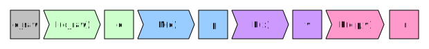
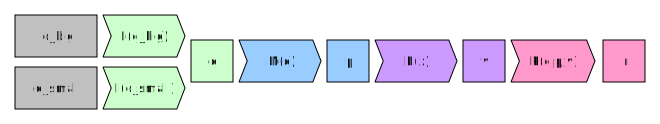
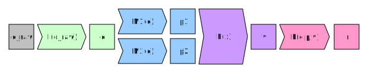

================================================
Chapter 1: Understanding data analysis workflows
================================================

**********************
Data analysis pipeline
**********************

Data analysis workflows are commonly split to four steps:

1. Data perparation and loading
2. Modeling
3. Evaluation
4. Presentation

From now on will call this the **data analysis pipeline**.

Data preparation and loading
============================

Data preparation and loading represents the process of preparing your
data into a format that is usable for analysis. One might think that
this is a very simple procedure, but in reality it is usually the most
time intensive part. Without proper data there can be no data analysis
and data is rarely provided in a format that is perfect to the task at
hand.

Cleaning up data, combining it with other data and creating a
efficient data pipeline depends heavily on the task at hand and thus
it requires a lot of manual effort. Badly done data preparation will
also propagate throughout the data analysis pipeline.

Let's call the input data ``d_raw`` and let's denote our input data
processing steps as ``I(x)``. After we have run the data processing we
will obtain a clean version of data called ``d``. So basically,
``d = I(d_raw)``.

Modeling
========

Modeling in this context refers to applying some algorithm, model or
statistics calculation to the data. So based on the data ``d``, we
apply some model ``M(x)`` to the data and we obtain an output parameters
``p``. Here output ``p`` can mean anything from statistics (e.g. mean, var)
to fit coefficients. So basically, ``p=M(d)``.

.. image:: images/pipeline-2.svg

The process of choosing a suitable model based on our problem and
obtaining the output ``p`` is what is usually thought of being the whole
data analysis, but the whole data analysis pipeline contains other
steps as well.

Evaluation
==========

After we have obtained the output ``p`` from our model we need to
evaluate whether our model suits the task at hand. This step can be
automatic (we choose best performing model based on fit performance,
we test model on test data) or manual (we look at the parameters, we look
at a plot of fit). Let's call this step as ``E(x)`` and its output
values as ``v``. So again, ``v=E(p)``.

.. image:: images/pipeline-3.svg

Presentation
============

The last step of our pipeline is to present our results in a suitable
format. This might include the creation of tables, plots or even interactive
widgets. Let's call this step ``P(data, parameters, evaluation)`` and
just for clarity let's use all of our collected knowledge of the problem
as an input. The output result ``r`` is now our finished product that
we'll show to our colleagues, put into our paper etc. So basically,
``r=P(d,p,v)``.

Now we have our finished pipeline. Now let's investigate why this is
important.

.. challenge:: Understanding data analysis pipelines

  A example pipeline is provided in ``X_exercises/ch1-X-ex1.ipynb``.

  1. Look through the example pipeline. Mark which cells belong to which categories in this categorization:

    - Data perparation and loading
    - Modeling
    - Evaluation
    - Presentation

  2. Try to determine the pieces of the code that are **unique** to this specific dataset. Discuss how you would generalize this pipeline to other datasets.

***********************************************************
Modularity & Interfacing - Why pipeline design is important
***********************************************************

Thinking about a data science problem in a pipeline form is important
because it highlights two important features:

1. Modularity
2. Interfacing

Modularity
==========

Modularity means that instead of having one big function or script to
handle the whole pipeline you have multiple independent pieces. In our
example pipeline we had functions ``I(x)``, ``M(x)``, ``E(x)`` and
``P(d,p,v)`` that independently handled specific parts of the pipeline.

For example, consider the situation where we have a multiple similar, but
separate, datasets that we want to analyze independently. Now if our
input parsing function ``I(x)`` can take any of these datasets the pipeline
can easily data-parallelized (more on this later).

.. image:: images/pipeline-modularity-1.svg

Of course we could write an input parser that works on all of the
datasets at the same time and in some cases this might be preferable.

As another example let's consider a problem where we would like to first
test the analysis modules of our pipeline on a subset of our original data
(e.g. stored in a file), but the actual data we want to analyze is stored
in a data store (e.g. SQL, Hadoop, data lake). This kind of a situation
is very common in industry.

Another place where modularity will show its imporance is a case where
there's multiple models that needs to be evaluated (e.g. ensemble modeling).
By creating independent models that each accept the input data and produce
an output that can be evaluated by the evaluation module we can reuse
most of our pipeline with minimal changes.

Modularity is important as it allows us to re-use pieces of our pipeline
on various different tasks. It also makes testing and verifying our results
easier as we can test individual pieces of our program independently.

Modularity in the wild
======================

Pandas as a library has been designed with modularity in mind right from
the start. Each function in it has a specific task they need to accomplish
and the output is usually of the same type as the input. Functions are short
and the API tries to be as clean as possible. See slides 9, 13, 17 and 18 from
Wes McKinney's (pandas creator)
`presentation in NYCPython conference in 2012 <https://wesmckinney.com/blog/nycpython-1102012-a-look-inside-pandas-design-and-development/>`_ for more information.

Same can be said about R's tidyverse ecosystem. The ecosystem is designed
to use simple functions with human-readable names. See Hadley Wickham's
(tidyverse creator)
`tidy tools manifesto <https://tidyverse.tidyverse.org/articles/manifesto.html>`_
for more information.

Interfacing
===========

Modularity as a design principle is all fine and good, but for it to be really
effective, there needs to be good communication between the modules. This means
that there should be well defined interfaces between modules or, in other words,
for each module the output of the module should be in a format that can be
used as an input for the next module.

In the previous example of a pipeline with two models ``M1(x)`` and ``M2(x)``
we implicitly assumed that the model evaluation function ``E(x)`` could
read in the output of the models.

As an example, in R the
`residuals-function <https://www.rdocumentation.org/packages/stats/versions/3.6.2/topics/residuals>`_
is defined for all model fitting functions and it will provide model
residuals. Thus if our evaluation function were to use
`residual sum of squares <https://en.wikipedia.org/wiki/Residual_sum_of_squares>`_
as a criterion of model evaluation, it would work with **all models that have a
residuals-function**. This is an example of a good interface.

Interfacing in the wild
=======================

Both pandas and R's tidyverse try to utilize a consistent strategy with data
structures. In pandas functions usually taka a ``Series``- or
``DataFrame``-objects and as their output they usually provide a similar
object. In R's tidyverse tries to do the same with ``tibble``-structures. By
having a consistent data type throughout the data analysis pipeline coding
becomes much easier: the API's just work.

This is also extremely important in the industry. Analyzing big data requires
good interfaces. For a good example, see
`Steve Yegge's rant on Google's platforms and on Jeff Bezos' 2002 interface mandate <https://gist.github.com/chitchcock/1281611>`_.

Creating modules for a pipeline
===============================

Many complete pipelines have modules written as functions. In many deep
learning frameworks these modules are also written as Python classes. For now
let's re-write the modules in exercise 1 pipeline as functions.

For example, the data loading for ``iris.data`` could be written in
the following way:

.. tabs::

  .. tab:: Python

    .. code-block:: python

        # Define iris data loading function
        def load_iris(iris_data_file):
            iris_data = pd.read_csv(
                iris_data_file,
                names=['Sepal.Length', 'Sepal.Width', 'Petal.Length', 'Petal.Width', 'Species'],
            )
            iris_data['Species'] = iris_data['Species'].map(lambda x: x.replace('Iris-','')).astype('category')
            iris_data = iris_data.rename(columns={'Species':'Target'})
            return iris_data

        iris_data = load_iris('../data/iris.data')

  .. tab:: R

    .. code-block:: r

        # Define iris data loading function
        load_iris <- function(iris_data_file) {
            iris_data <- read_csv(iris_data_file, col_names=c('Sepal.Length', 'Sepal.Width', 'Petal.Length', 'Petal.Width', 'Species')) %>%
                mutate(Species=str_remove(Species, 'Iris-')) %>%
                mutate(Species=as.factor(Species)) %>%
                rename(Target=Species)
            return(iris_data)
        }

        iris_data = load_iris('../data/iris.data')

It might look like this approach just increases the amount of code needed and
would not provide any benefits, but after we create a function for the row
shuffling functionality, we can start to see the advantage of our approach.
The ``shuffle_rows``-function might look something like this:

.. tabs::

  .. tab:: Python

    .. code-block:: python

        # Define function for dataset row shuffling
        def shuffle_rows(data, random_state=None):
            shuffled_data = data.sample(frac=1, random_state=random_state).reset_index(drop=True)
            return shuffled_data

        random_state = RandomState(seed=42)
        iris_data = shuffle_rows(iris_data, random_state)

  .. tab:: R

    .. code-block:: r

        # Define function for dataset row shuffling
        shuffle_rows <- function(data) {
            sample_ix <- sample(nrow(data))
            shuffled_data <- data[sample_ix,]
            return(shuffled_data)
        }

        set.seed(42)
        iris_data <- shuffle_rows(iris_data)

At this point it is important to notice that our `shuffle_rows`-function
works with **any** dataset that is similar to our original ``iris``-dataset.

Let's finish off the whole pipeline with functions for dataset splitting,
modeling, model evaluation and result plotting:

.. tabs::

  .. tab:: Python

    .. code-block:: python

        # Define function for dataset splitting 
        def split_dataset(data, train_fraction=0.8,random_state=None):
            train_split, test_split = train_test_split(data, train_size=train_fraction, random_state=random_state)
            print('Train split proportions:')
            print(train_split.groupby('Target').size())
            print('Test split proportions:')
            print(test_split.groupby('Target').size())
            return (train_split, test_split)

        # Define function for decision tree classification
        def decision_tree_classifier(train_split, random_state=None):
            tree = DecisionTreeClassifier(random_state=random_state)
            train_data = train_split.drop('Target', axis=1)
            train_target = train_split['Target']
            fitted_tree = tree.fit(train_data, train_target)
            print(export_text(fitted_tree, feature_names=list(train_data.columns)))
            return(fitted_tree)

        # Define function for model evaluation
        def prediction_evaluation(test_split, model):
            test_data = test_split.drop('Target', axis=1)
            test_target = test_split['Target']
            result_data = test_split.copy()
            result_data['PredictedValue'] = model.predict(test_data)
            result_data['Prediction'] = result_data.apply(lambda x: x['Target'].capitalize() if x['Target'] == x['PredictedValue'] else 'Classification failure', axis=1)
            print('Confusion matrix:\n', confusion_matrix(result_data['PredictedValue'], result_data['Target']))
            print('Accuracy: ', accuracy_score(result_data['PredictedValue'], result_data['Target']))
            return result_data

        # Define function for prediction plotting
        def plot_predictions(fitted_data, x, y):
            petal_plot, petal_plot_ax = plt.subplots(figsize=(6.5, 6.5))
            sb.scatterplot(x=x, y=y, data=fitted_data, hue=fitted_data['Prediction'])

  .. tab:: R

    .. code-block:: r

        # Define function for dataset splitting
        split_dataset <- function(data, train_fraction=0.8) {
            dataset_split <- data %>%
                resample_partition(c(train=train_fraction, test=1-train_fraction))
            print('Train split proportions:')
            dataset_split$train %>%
                as_tibble() %>%
                group_by(Target) %>%
                tally() %>%
                show()
            print('Test split proportions:')
            dataset_split$test %>%
                as_tibble() %>%
                group_by(Target) %>%
                tally() %>%
                show()
            return(dataset_split)
        }

        # Define function for decision tree classification
        decision_tree_classifier <- function(train_data) {
            fitted_tree <- train_data %>%
                as_tibble() %>%
                rpart(Target ~ ., data=., method='class')
            print(fitted_tree)
            return(fitted_tree)
        }

        # Define function for model evaluation
        prediction_evaluation <- function(test_data, model) {
            prediction_data <- test_data %>%
                as_tibble() %>%
                mutate(PredictedValue = predict(model, newdata=., type='class')) %>%
                mutate(Prediction=ifelse(Target == PredictedValue, str_to_title(as.character(Target)), 'Classification failure'))
            show(confusionMatrix(prediction_data$Target, prediction_data$PredictedValue))
            return(prediction_data)
        }

        # Define function for prediction plotting
        plot_predictions <- function(fitted_data, x, y) {
            options(repr.plot.width=13, repr.plot.height=7)
            ggplot(data=fitted_data, aes_string(x=x, y=y, color='Prediction')) +
                geom_point()
        }

Now we can run the whole pipeline with:

.. tabs::

  .. tab:: Python

    .. code-block:: python

        random_state = RandomState(seed=42)
        iris_data = load_iris('../data/iris.data')
        iris_data = shuffle_rows(iris_data, random_state)
        iris_train, iris_test = split_dataset(iris_data, train_fraction=0.8, random_state=random_state)
        iris_fitted_tree = decision_tree_classifier(iris_train, random_state=random_state)
        iris_predicted = prediction_evaluation(iris_test, iris_fitted_tree)
        plot_predictions(iris_predicted, 'Petal.Width', 'Petal.Length')
        plot_predictions(iris_predicted, 'Sepal.Width', 'Sepal.Length')

  .. tab:: R

    .. code-block:: r
    
        set.seed(42)
        iris_data <- load_iris('../data/iris.data')
        iris_data <- shuffle_rows(iris_data)
        iris_split <- split_dataset(iris_data, train_fraction=0.8)
        iris_fitted_tree <- decision_tree_classifier(iris_split$train)
        iris_predicted <- prediction_evaluation(iris_split$test, iris_fitted_tree)
        plot_predictions(iris_predicted, x='Petal.Width', y='Petal.Length')
        plot_predictions(iris_predicted, x='Sepal.Width', y='Sepal.Length')

Writing our pipeline in this way provides many benefits:

- We can see our whole pipeline with a single glance.
- We can easily modify our pipeline e.g. disable shuffling. 
- We can easily see and change our pipeline's hyperparameters (e.g. test
  different values of `train_fraction`). 
- By swapping `load_iris`-function to some other function that provides
  its output in similar format, we can run the same pipeline on a different
  dataset.
- By swapping `decision_tree_classifier`-function to some other function that
  provides its output in similar format, we can run the same pipeline on a
  different model.

However, it is also important to know that by writing our pipeline in this way
we have created interfaces. Thus reliability of our pipeline relies on the fact
that various hidden requirements are being fulfilled:

- Using our chosen model makes sense in the context.
- Data is in tidy format (`DataFrame`/`tibble`).
- Target variable is in `Target`-column and there are no unnecessary variables.
- The fitted model supports the `predict`-function for obtaining predictions.
- Prediction names are stored in 'Prediction'-column.
- etc.

It might look like the amount of requirements would grow very rapidly and thus
there would not be any generality to our pipeline. However, in Python and R the
community is very good at using standards. E.g. in 
`scikit-learn <https://scikit-learn.org/stable/glossary.html#term-predict>`_
and in
`R <https://www.rdocumentation.org/packages/stats/versions/3.6.2/topics/predict>`_
the predict-methods are well defined. By adhering to the same standards that
everybody else uses you will immediately get the benefits: hundreds of
different models and libraries.

In the next exercise we try to extend our pipeline.

.. challenge:: Extending our data analysis pipeline

  A example pipeline is provided in ``X_exercises/ch1-X-ex2.ipynb``.

  Let's modify our simple data analysis pipeline so that it can handle another
  classifications task: classifying breast cancers from a
  `another famous dataset <http://archive.ics.uci.edu/ml/datasets/breast+cancer+wisconsin+%28diagnostic%29>`_.
  This problem is bit trickier for a simple model such as decision tree, so
  let's try out
  `random forest classifier <https://en.wikipedia.org/wiki/Random_forest>`_,
  which uses an ensemble of decision trees and let's compare the results. 

  Problems are described in more detail in the example notebooks:

  1. Create a data loading function for our new dataset.

  2. Test the data loading function by running a pipeline with decision
     tree classifier. Analyze results.
  
  3. Create a function for random forest classifier. Use the function in
     the place of our decision tree classifier to classify cancer
     diagnoses.
     
  4. Use the random forest classifier in our iris pipeline. Analyze results.