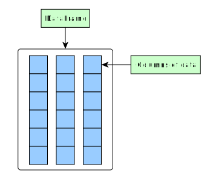

===========================
Chapter 2: Data preparation
===========================

.. important::

    Commands run on this chapter are present in the
    ``X_exercises/ch2-X-lecture.ipynb``, where ``X`` is the programming
    language.

*********
Tidy data
*********

Both R (``data.frame`` and ``tibble``) and pandas (``DataFrame``) store the
data as columnar vectors. They are in a so-called column-oriented format.

When the data is organized in a way where each column corresponds to a
variable and each row corresponds to a observation, we consider the dataset
**tidy**.

This image from Hadley Wickham's excellent book
`R for Data Science <https://r4ds.had.co.nz/>`_ visualizes the idea:

.. image:: https://raw.githubusercontent.com/hadley/r4ds/master/images/tidy-1.png

The name "tidy data" comes from Wickham's
`paper (2014) <https://vita.had.co.nz/papers/tidy-data.pdf>`_, that describes
the ideas in great detail.

The choice of this data format is by no means a one man show: in fact Wickham
cites Wes McKinney's
`paper (2010) <http://conference.scipy.org/proceedings/scipy2010/pdfs/mckinney.pdf>`_
on Pandas' chosen data format as an example of a tidy data format. In fact both
`R <https://rstudio.com/wp-content/uploads/2015/02/data-wrangling-cheatsheet.pdf>`_
and `Pandas <https://pandas.pydata.org/Pandas_Cheat_Sheet.pdf>`_ developers
recommend using tidy data.

Main reasons why this data format is recommended are:

1. It is easy to understand and helps to internalize how your data is
   organized.
2. In tidy data format all observations in a variable have the same data
   type. This means that columns can be stored as vectors. This saves memory
   and allows for vectorized calculations that are much faster.
3. It is easy for developers to create methods as they can assume how the data
   is organized.

There are cases where tidy data might not be the optimal format. For example, if
your problem has matrices, you would not want to store it as rows and columns,
but as a two-dimensional array. Another situation might arise when your data is
in some other binary format e.g. image data. But in these cases you might
want to use tidy data to store e.g. image names or model parameters.

In this course our data is mostly in tidy format and if it's not in that
format, we'll want to convert our raw data into it as soon as possible.

.. challenge:: Parsing Premiere League games - Problem 1

    The exercise is provided in ``X_exercises/ch2-X-ex1.ipynb``.

    In the exercise we'll create input parsing functions for
    `Premier League results <https://github.com/footballcsv/england>`_.

    - Look at the one of the
      ``./data/england-master/XXXXs/XXXX-XX/eng.1.csv``-datasets.
    - Determine whether the data is in a tidy format.
    - If not, how would you modify the data format?

**********************
Simple data operations
**********************

Loading data from CSVs
======================

Let's start with loading data in the most common data format: csv. Quite often
datasets are provided in this format because it is human readable and easy to
transfer among systems.

Let's consider a ``atp_players.csv``-dataset that contains ATP ranks of men's
singles tennis players.

Let's load the data with the ``read_csv``-function:

.. tabs::

  .. tab:: Python
  
    `pandas.read_csv <https://pandas.pydata.org/pandas-docs/stable/reference/api/pandas.read_csv.html>`_

    .. code-block:: python
    
        atp_players = pd.read_csv('../data/atp_players.csv', names=['player_id', 'first_name', 'last_name', 'hand', 'birth_date', 'country_code'])
        atp_players.head()
        	player_id 	first_name 	last_name 	hand 	birth_date 	country_code
        0 	100001 	Gardnar 	Mulloy 	R 	19131122.0 	USA
        1 	100002 	Pancho 	Segura 	R 	19210620.0 	ECU
        2 	100003 	Frank 	Sedgman 	R 	19271002.0 	AUS
        3 	100004 	Giuseppe 	Merlo 	R 	19271011.0 	ITA
        4 	100005 	Richard Pancho 	Gonzales 	R 	19280509.0 	USA

  .. tab:: R
  
    `Tidyverse read_csv <https://readr.tidyverse.org/reference/read_delim.html>`_

    .. code-block:: R
    
        atp_players <- read_csv('../data/atp_players.csv', col_names=c('player_id', 'first_name', 'last_name', 'hand', 'birth_date', 'country_code'))
        Parsed with column specification:
        cols(
          player_id = col_double(),
          first_name = col_character(),
          last_name = col_character(),
          hand = col_character(),
          birth_date = col_double(),
          country_code = col_character()
        )
        player_id	first_name	last_name	hand	birth_date	country_code
        100001 	Gardnar 	Mulloy 	R 	19131122 	USA
        100002 	Pancho 	Segura 	R 	19210620 	ECU
        100003 	Frank 	Sedgman 	R 	19271002 	AUS
        100004 	Giuseppe 	Merlo 	R 	19271011 	ITA
        100005 	Richard Pancho	Gonzales 	R 	19280509 	USA
        100006 	Grant 	Golden 	R 	19290821 	USA

This function not only parses the text, but also tries to convert the columns
to a best possible fata types. To check column data types, use:

.. tabs::

  .. tab:: Python

    .. code-block:: python
    
        print(iris.dtypes)
        player_id         int64
        first_name       object
        last_name        object
        hand             object
        birth_date      float64
        country_code     object
        dtype: object

  .. tab:: R

    .. code-block:: R
    
        str(atp_players)
    
        Classes ‘spec_tbl_df’, ‘tbl_df’, ‘tbl’ and 'data.frame':	54938 obs. of  6 variables:
         $ player_id   : num  1e+05 1e+05 1e+05 1e+05 1e+05 ...
         $ first_name  : chr  "Gardnar" "Pancho" "Frank" "Giuseppe" ...
         $ last_name   : chr  "Mulloy" "Segura" "Sedgman" "Merlo" ...
         $ hand        : chr  "R" "R" "R" "R" ...
         $ birth_date  : num  19131122 19210620 19271002 19271011 19280509 ...
         $ country_code: chr  "USA" "ECU" "AUS" "ITA" ...
         - attr(*, "spec")=
          .. cols(
          ..   player_id = col_double(),
          ..   first_name = col_character(),
          ..   last_name = col_character(),
          ..   hand = col_character(),
          ..   birth_date = col_double(),
          ..   country_code = col_character()
          .. )

The ``head``-function can be used to show the first few rows of our dataset.

.. tabs::

  .. tab:: Python

    .. code-block:: python
    
        atp_players.head()
        
        	player_id 	first_name 	last_name 	hand 	birth_date 	country_code
        0 	100001 	Gardnar 	Mulloy 	R 	19131122.0 	USA
        1 	100002 	Pancho 	Segura 	R 	19210620.0 	ECU
        2 	100003 	Frank 	Sedgman 	R 	19271002.0 	AUS
        3 	100004 	Giuseppe 	Merlo 	R 	19271011.0 	ITA
        4 	100005 	Richard Pancho 	Gonzales 	R 	19280509.0 	USA

  .. tab:: R

    .. code-block:: R
    
        head(atp_players)
    
        player_id	first_name	last_name	hand	birth_date	country_code
        100001 	Gardnar 	Mulloy 	R 	19131122 	USA
        100002 	Pancho 	Segura 	R 	19210620 	ECU
        100003 	Frank 	Sedgman 	R 	19271002 	AUS
        100004 	Giuseppe 	Merlo 	R 	19271011 	ITA
        100005 	Richard Pancho	Gonzales 	R 	19280509 	USA
        100006 	Grant 	Golden 	R 	19290821 	USA 

Creating and removing columns
=============================

Let's start by converting the birth date column into an actual time stamp.

.. tabs::

  .. tab:: Python
  
    `pandas.to_datetime <https://pandas.pydata.org/pandas-docs/stable/reference/api/pandas.to_datetime.html>`_

    .. code-block:: python
    
        atp_players['birth_date'] = pd.to_datetime(atp_players['birth_date'], format='%Y%m%d', errors='coerce')
        print(atp_players.dtypes)
        
        player_id                int64
        first_name              object
        last_name               object
        hand                    object
        birth_date      datetime64[ns]
        country_code            object
        dtype: object

  .. tab:: R
  
    `Tidyverse mutate <https://dplyr.tidyverse.org/reference/mutate.html>`__
    
    `Lubridate parse_date_time <https://lubridate.tidyverse.org/reference/parse_date_time.html>`_

    .. code-block:: R
    
        atp_players <- atp_players %>%
            mutate(birth_date=parse_date_time(birth_date, order='%Y%m%d'))
        str(atp_players)

        Warning message:
        “ 125 failed to parse.”

        Classes ‘spec_tbl_df’, ‘tbl_df’, ‘tbl’ and 'data.frame':	54938 obs. of  6 variables:
         $ player_id   : num  1e+05 1e+05 1e+05 1e+05 1e+05 ...
         $ first_name  : chr  "Gardnar" "Pancho" "Frank" "Giuseppe" ...
         $ last_name   : chr  "Mulloy" "Segura" "Sedgman" "Merlo" ...
         $ hand        : chr  "R" "R" "R" "R" ...
         $ birth_date  : POSIXct, format: "1913-11-22" "1921-06-20" ...
         $ country_code: chr  "USA" "ECU" "AUS" "ITA" ...

In our current situation we have separate columns for first and last names.
Let's join these columns into one column called ``name``:

.. tabs::

  .. tab:: Python

    .. code-block:: python
    
        atp_players['name'] = atp_players['last_name'] + ', ' + atp_players['first_name']
        
        atp_players.head()
        
         	player_id 	first_name 	last_name 	hand 	birth_date 	country_code 	name
        0 	100001 	Gardnar 	Mulloy 	R 	19131122.0 	USA 	Mulloy, Gardnar
        1 	100002 	Pancho 	Segura 	R 	19210620.0 	ECU 	Segura, Pancho
        2 	100003 	Frank 	Sedgman 	R 	19271002.0 	AUS 	Sedgman, Frank
        3 	100004 	Giuseppe 	Merlo 	R 	19271011.0 	ITA 	Merlo, Giuseppe
        4 	100005 	Richard Pancho 	Gonzales 	R 	19280509.0 	USA 	Gonzales, Richard Pancho

  .. tab:: R
  
    `Tidyverse unite <https://tidyr.tidyverse.org/reference/unite.html>`_

    .. code-block:: R
    
        atp_players <- atp_players %>%
            unite(name, last_name, first_name, sep=', ', remove=FALSE)

        head(atp_players)

        player_id	name	first_name	last_name	hand	birth_date	country_code
        100001 	Mulloy, Gardnar 	Gardnar 	Mulloy 	R 	19131122 	USA
        100002 	Segura, Pancho 	Pancho 	Segura 	R 	19210620 	ECU
        100003 	Sedgman, Frank 	Frank 	Sedgman 	R 	19271002 	AUS
        100004 	Merlo, Giuseppe 	Giuseppe 	Merlo 	R 	19271011 	ITA
        100005 	Gonzales, Richard Pancho	Richard Pancho 	Gonzales 	R 	19280509 	USA
        100006 	Golden, Grant 	Grant 	Golden 	R 	19290821 	USA

Now we can drop our unneeded columns:

.. tabs::

  .. tab:: Python
  
    `pandas.DataFrame.drop <https://pandas.pydata.org/pandas-docs/stable/reference/api/pandas.DataFrame.drop.html>`_

    .. code-block:: python
    
        atp_players.drop(['first_name','last_name'], axis=1, inplace=True)
        atp_players.dtypes
        
        player_id         int64
        hand             object
        birth_date      float64
        country_code     object
        name             object
        dtype: object

  .. tab:: R
  
    `Tidyverse select <https://dplyr.tidyverse.org/reference/select.html>`_

    .. code-block:: R
    
        atp_players <- atp_players %>%
            select(-first_name, -last_name)

        str(atp_players)
        
        Classes ‘tbl_df’, ‘tbl’ and 'data.frame':	54938 obs. of  5 variables:
         $ player_id   : num  1e+05 1e+05 1e+05 1e+05 1e+05 ...
         $ name        : chr  "Mulloy, Gardnar" "Segura, Pancho" "Sedgman, Frank" "Merlo, Giuseppe" ...
         $ hand        : chr  "R" "R" "R" "R" ...
         $ birth_date  : num  19131122 19210620 19271002 19271011 19280509 ...
         $ country_code: chr  "USA" "ECU" "AUS" "ITA" ...

Turning input processing tasks into functions
=============================================

Now that we have an idea what operations we want to accomplish for our data
loading, we should codify these operations by creating a data loading function.

Let's create a data loading function for loading ATP player data:

.. tabs::

  .. tab:: Python

    .. code-block:: python

        def load_atp_players(atp_players_file):
            atp_players = pd.read_csv(atp_players_file, names=['player_id', 'first_name', 'last_name', 'hand', 'birth_date', 'country_code'])
            atp_players.loc[:,'birth_date'] = pd.to_datetime(atp_players.loc[:,'birth_date'], format='%Y%m%d', errors='coerce')
            atp_players['name'] = atp_players.loc[:,'last_name'] + ', ' + atp_players.loc[:,'first_name']
            atp_players.drop(['first_name','last_name'], axis=1, inplace=True)
            return atp_players

        atp_players = load_atp_players('../data/atp_players.csv')
        atp_players.head()

        player_id 	first_name 	last_name 	hand 	birth_date 	country_code 	name
        0 	100001 	Gardnar 	Mulloy 	R 	1913-11-22 	USA 	Mulloy, Gardnar
        1 	100002 	Pancho 	Segura 	R 	1921-06-20 	ECU 	Segura, Pancho
        2 	100003 	Frank 	Sedgman 	R 	1927-10-02 	AUS 	Sedgman, Frank
        3 	100004 	Giuseppe 	Merlo 	R 	1927-10-11 	ITA 	Merlo, Giuseppe
        4 	100005 	Richard Pancho 	Gonzales 	R 	1928-05-09 	USA 	Gonzales, Richard Pancho

  .. tab:: R

    .. code-block:: R

        load_atp_players <- function(atp_players_file){
            atp_players <- read_csv(atp_players_file, col_names=c('player_id', 'first_name', 'last_name', 'hand', 'birth_date', 'country_code'), col_types=cols()) %>%
                mutate(birth_date=parse_date_time(birth_date, order='%Y%m%d')) %>%
                unite(name, last_name, first_name, sep=', ', remove=TRUE) %>%
                mutate_at(c('country_code', 'hand'), as.factor)
            return(atp_players)
        }

        atp_players <- load_atp_players('../data/atp_players.csv')
        head(atp_players)

        Warning message:
        “ 125 failed to parse.”

        player_id	name	hand	birth_date	country_code
        100001 	Mulloy, Gardnar 	R 	1913-11-22 	USA
        100002 	Segura, Pancho 	R 	1921-06-20 	ECU
        100003 	Sedgman, Frank 	R 	1927-10-02 	AUS
        100004 	Merlo, Giuseppe 	R 	1927-10-11 	ITA
        100005 	Gonzales, Richard Pancho	R 	1928-05-09 	USA
        100006 	Golden, Grant 	R 	1929-08-21 	USA

.. challenge:: Parsing Premiere League games - Problem 2

    The exercise is provided in ``X_exercises/ch2-X-ex1.ipynb``.

    In this exercise we'll create input parsing functions for
    `Premier League results <https://github.com/footballcsv/england>`_.

    - Create a function that loads the match data, converts date
      into a proper date object and determines the season from
      the date.

Categorical data format
=======================

When working with string data that has well defined categories, it is usually a
good idea to convert the data into categorical (Python) / factor (R) format.
In this format all unique strings are given an integer value and the string
array is converted into an integer array with this mapping. The unique strings
are called "categories" or "levels" of the categorical/factor array. 

Main benefits of using categorical data are:

- Makes it easier to re-categorize the data by combining levels.
- Helps with grouping and plot labeling.
- Reduced memory consumption.

Disadvantages include:

- For string arrays with completely unique values (e.g. our ``name``-column),
  most of the benefits are lost.
- Some models may recognize categorical data as numeric data as the underlying
  format in memory is an integer array. Check documentation of your modeling
  function whether it works with categorical data.

.. tabs::

  .. tab:: Python

    `Pandas categorical <https://pandas.pydata.org/pandas-docs/stable/user_guide/categorical.html>`_

    `Pandas apply <https://pandas.pydata.org/pandas-docs/stable/reference/api/pandas.DataFrame.apply.html>`_

    .. code-block:: python

        atp_players_categorized = atp_players.copy()
        print(atp_players_categorized['hand'].nbytes)
        atp_players_categorized.loc[:,['country_code', 'hand']] = atp_players_categorized.loc[:, ['country_code', 'hand']].apply(lambda x: x.astype('category'))
        print(atp_players_categorized['country_code'].nbytes)
        print(atp_players_categorized['hand'].cat.categories)
        atp_players_categorized.dtypes

        54970
        111556
        Index(['A', 'L', 'R', 'U'], dtype='object')

        player_id                int64
        hand                  category
        birth_date      datetime64[ns]
        country_code          category
        name                    object
        dtype: object

  .. tab:: R

    `R factor <https://www.rdocumentation.org/packages/base/versions/3.6.2/topics/factor>`_

    `Tidyverse mutate_at <https://dplyr.tidyverse.org/reference/mutate_all.html>`__

    .. code-block:: R

        object.size(atp_players[['hand']])
        atp_players <- atp_players %>%
            mutate_at(c('country_code', 'hand'), as.factor)
        object.size(atp_players[['hand']])
        print(levels(atp_players[['hand']]))
        str(atp_players)
        
        439776 bytes
        220440 bytes
        [1] "A" "L" "R" "U"
        Classes ‘tbl_df’, ‘tbl’ and 'data.frame':	54938 obs. of  5 variables:
         $ player_id   : num  1e+05 1e+05 1e+05 1e+05 1e+05 ...
         $ name        : chr  "Mulloy, Gardnar" "Segura, Pancho" "Sedgman, Frank" "Merlo, Giuseppe" ...
         $ hand        : Factor w/ 4 levels "A","L","R","U": 3 3 3 3 3 3 2 3 3 3 ...
         $ birth_date  : num  19131122 19210620 19271002 19271011 19280509 ...
         $ country_code: Factor w/ 210 levels "AFG","AHO","ALB",..: 200 62 13 97 200 200 160 58 88 43 ...

Let's create a function for this behaviour as well:

.. tabs::

  .. tab:: Python

    .. code-block:: python

        def categorize_players(players):
            players.loc[:,['country_code', 'hand']] = players.loc[:, ['country_code', 'hand']].apply(lambda x: x.astype('category'))
            return players

        print(atp_players.dtypes)
        atp_players = categorize_players(atp_players)
        atp_players.dtypes

        player_id                int64
        hand                    object
        birth_date      datetime64[ns]
        country_code            object
        name                    object
        dtype: object

        player_id                int64
        hand                  category
        birth_date      datetime64[ns]
        country_code          category
        name                    object
        dtype: object

  .. tab:: R

    .. code-block:: R

        categorize_players <- function(players) {
            players <- players %>%
                mutate_at(c('country_code', 'hand'), as.factor)
            return(players)
        }
        str(atp_players)
        atp_players <- categorize_players(atp_players)
        str(atp_players)
        
        Classes ‘tbl_df’, ‘tbl’ and 'data.frame':	54938 obs. of  5 variables:
         $ player_id   : num  1e+05 1e+05 1e+05 1e+05 1e+05 ...
         $ name        : chr  "Mulloy, Gardnar" "Segura, Pancho" "Sedgman, Frank" "Merlo, Giuseppe" ...
         $ hand        : chr  "R" "R" "R" "R" ...
         $ birth_date  : POSIXct, format: "1913-11-22" "1921-06-20" ...
         $ country_code: chr  "USA" "ECU" "AUS" "ITA" ...
        Classes ‘tbl_df’, ‘tbl’ and 'data.frame':	54938 obs. of  5 variables:
         $ player_id   : num  1e+05 1e+05 1e+05 1e+05 1e+05 ...
         $ name        : chr  "Mulloy, Gardnar" "Segura, Pancho" "Sedgman, Frank" "Merlo, Giuseppe" ...
         $ hand        : Factor w/ 4 levels "A","L","R","U": 3 3 3 3 3 3 2 3 3 3 ...
         $ birth_date  : POSIXct, format: "1913-11-22" "1921-06-20" ...
         $ country_code: Factor w/ 210 levels "AFG","AHO","ALB",..: 200 62 13 97 200 200 160 58 88 43 ...

Joining datasets together
=========================

Quite often the data one obtains is not in a single file, but spread across
multiple files. In situations like these you'll need to combine these datasets.
However, there are different ways to combine datasets:

1. Concatenation / adding rows. In concatenation one dataset, with a certain
   column format, is combined with another dataset with the same column format.
   **This process is usually slow** because adding rows requires allocation of
   new column vectors. Thus one should avoid these operations beyond the
   initial data creation.
   
2. Joining / adding columns. During joining process columns from a dataset
   with a certain column format are added into another dataset with a different
   column format. When joining, it is important that the datasets have a some
   common column (or an index) that can be used to match different
   rows/observations. **This process is usually fast**, but one should always
   determine the correct type of join type (left, right, union, full) to avoid
   unnecessary NA-values. With large datasets (or databases) one should also
   always first select the areas of interest and join those, not the other way
   around.
   
Let's consider the data files ``atp_rankings_00s.csv`` and
``atp_rankings_10s.csv`` that contain the weekly ATP rankings from the
2000s and 2010s. Let's load these datasets:

.. tabs::

  .. tab:: Python

    .. code-block:: python
    
        def load_atp_rankings(atp_rankings_file):
            atp_rankings = pd.read_csv(atp_rankings_file)
            atp_rankings.loc[:,'ranking_date'] = pd.to_datetime(atp_rankings.loc[:, 'ranking_date'], format='%Y%m%d', errors='coerce')
            return atp_rankings

        atp_rankings00 = load_atp_rankings('../data/atp_rankings_00s.csv')
        atp_rankings10 = load_atp_rankings('../data/atp_rankings_10s.csv')

        print(atp_rankings00.head())
        print(atp_rankings10.head())
        
          ranking_date  rank  player  points
        0   2000-01-10     1  101736  4135.0
        1   2000-01-10     2  102338  2915.0
        2   2000-01-10     3  101948  2419.0
        3   2000-01-10     4  103017  2184.0
        4   2000-01-10     5  102856  2169.0
          ranking_date  rank  player   points
        0   2010-01-04     1  103819  10550.0
        1   2010-01-04     2  104745   9205.0
        2   2010-01-04     3  104925   8310.0
        3   2010-01-04     4  104918   7030.0
        4   2010-01-04     5  105223   6785.0

  .. tab:: R
  
    .. code-block:: R
    
        load_atp_rankings <- function(atp_rankings_file){
            atp_rankings <- read_csv(atp_rankings_file, col_types=cols()) %>%
                mutate(ranking_date=parse_date_time(ranking_date, order='%Y%m%d'))
            return(atp_rankings)
        }

        atp_rankings00 <- load_atp_rankings('../data/atp_rankings_00s.csv')
        atp_rankings10 <- load_atp_rankings('../data/atp_rankings_10s.csv')

        head(atp_rankings00)
        head(atp_rankings10)

        ranking_date	rank	player	points
        2000-01-10	1 	101736 	4135
        2000-01-10	2 	102338 	2915
        2000-01-10	3 	101948 	2419
        2000-01-10	4 	103017 	2184
        2000-01-10	5 	102856 	2169
        2000-01-10	6 	102358 	2107
        ranking_date	rank	player	points
        2010-01-04	1 	103819 	10550
        2010-01-04	2 	104745 	9205
        2010-01-04	3 	104925 	8310
        2010-01-04	4 	104918 	7030
        2010-01-04	5 	105223 	6785
        2010-01-04	6 	103786 	4930 

Now, as we have two datasets with identical column format, we'll want to
concatenate these datasets together:

.. tabs::

  .. tab:: Python
  
    `pandas.concat <https://pandas.pydata.org/pandas-docs/stable/reference/api/pandas.concat.html>`_

    .. code-block:: python
    
        print(atp_rankings00.shape)
        print(atp_rankings10.shape)
        atp_rankings = pd.concat([atp_rankings00, atp_rankings10], ignore_index=True)
        print(atp_rankings.shape)
        atp_rankings.head()

        (920907, 4)
        (916296, 4)
        (1837203, 4)

            ranking_date 	rank 	player 	points
        0 	2000-01-10 	1 	101736 	4135.0
        1 	2000-01-10 	2 	102338 	2915.0
        2 	2000-01-10 	3 	101948 	2419.0
        3 	2000-01-10 	4 	103017 	2184.0
        4 	2000-01-10 	5 	102856 	2169.0

  .. tab:: R
  
    `Tidyverse bind_rows <https://dplyr.tidyverse.org/reference/bind.html>`_
  
    .. code-block:: R
    
        print(nrow(atp_rankings00))
        print(nrow(atp_rankings10))
        atp_rankings <- bind_rows(atp_rankings00, atp_rankings10)
        print(nrow(atp_rankings))
        print(head(atp_rankings))

        [1] 920907
        [1] 916296
        [1] 1837203
        # A tibble: 6 x 4
          ranking_date         rank player points
          <dttm>              <dbl>  <dbl>  <dbl>
        1 2000-01-10 00:00:00     1 101736   4135
        2 2000-01-10 00:00:00     2 102338   2915
        3 2000-01-10 00:00:00     3 101948   2419
        4 2000-01-10 00:00:00     4 103017   2184
        5 2000-01-10 00:00:00     5 102856   2169
        6 2000-01-10 00:00:00     6 102358   2107

At this point we can notice that the player identification number is not the
same on player- and ranking-datasets. We should rename this column, as we will
be using that to join these datasets together.

.. tabs::

  .. tab:: Python
  
    `pandas.DataFrame.rename <https://pandas.pydata.org/pandas-docs/stable/reference/api/pandas.DataFrame.rename.html>`_

    .. code-block:: python

        atp_rankings.rename(columns={'player':'player_id'}, inplace=True)

        atp_rankings.head()

            ranking_date 	rank 	player_id 	points
        0 	2000-01-10 	1 	101736 	4135.0
        1 	2000-01-10 	2 	102338 	2915.0
        2 	2000-01-10 	3 	101948 	2419.0
        3 	2000-01-10 	4 	103017 	2184.0
        4 	2000-01-10 	5 	102856 	2169.0

  .. tab:: R
  
    `Tidyverse rename <https://dplyr.tidyverse.org/reference/rename.html>`_
  
    .. code-block:: R
    
        atp_rankings <- atp_rankings %>%

            rename(player_id=player)

        head(atp_rankings)

        ranking_date	rank	player_id	points
        2000-01-10	1 	101736 	4135
        2000-01-10	2 	102338 	2915
        2000-01-10	3 	101948 	2419
        2000-01-10	4 	103017 	2184
        2000-01-10	5 	102856 	2169
        2000-01-10	6 	102358 	2107

Now that we have figured how we want to parse these datasets, let's create a
function that can read multiple files with a for-loop structure.
        
.. tabs::

  .. tab:: Python
  
    .. code-block:: python
  
        def load_multiple_atp_rankings(atp_rankings_files):
            datasets = []
            for atp_ranking_file in atp_rankings_files:
                dataset = load_atp_rankings(atp_ranking_file)
                datasets.append(dataset)
            atp_rankings = pd.concat(datasets, ignore_index=True)
            atp_rankings.rename(columns={'player':'player_id'}, inplace=True)
            return atp_rankings

        atp_rankings = load_multiple_atp_rankings(['../data/atp_rankings_00s.csv','../data/atp_rankings_10s.csv'])
        print(atp_rankings.shape)
        atp_rankings.head()
        
        (1837203, 4)

            ranking_date 	rank 	player_id 	points
        0 	2000-01-10 	1 	101736 	4135.0
        1 	2000-01-10 	2 	102338 	2915.0
        2 	2000-01-10 	3 	101948 	2419.0
        3 	2000-01-10 	4 	103017 	2184.0
        4 	2000-01-10 	5 	102856 	2169.0

  .. tab:: R
  
    `R list structure <https://www.rdocumentation.org/packages/base/versions/3.6.2/topics/list>`_

    `R append <https://www.rdocumentation.org/packages/base/versions/3.6.2/topics/append>`_
    
    .. code-block:: R
  
        load_multiple_atp_rankings <- function(atp_rankings_files){
            datasets <- list()
            for (atp_ranking_file in atp_rankings_files) {
                dataset <- load_atp_rankings(atp_ranking_file)
                datasets <- append(datasets, list(dataset))
            }
            atp_rankings <- bind_rows(datasets) %>%
                rename(player_id=player)
            return(atp_rankings)
        }

        atp_rankings <- load_multiple_atp_rankings(c('../data/atp_rankings_00s.csv','../data/atp_rankings_10s.csv'))
        print(nrow(atp_rankings))
        head(atp_rankings)

        [1] 1837203

        ranking_date	rank	player_id	points
        2000-01-10	1 	101736 	4135
        2000-01-10	2 	102338 	2915
        2000-01-10	3 	101948 	2419
        2000-01-10	4 	103017 	2184
        2000-01-10	5 	102856 	2169
        2000-01-10	6 	102358 	2107

This new function provides an interesting feature: we do not need to create
duplicate variables for our new datasets. We could be reading 2 or 2000 files
and our function would work identically.

Let's now combine this rankings dataset with our player dataset. Now we're
going to do dataset joining with ``player_id`` as our joining column. As our
players dataset contains a lot of players who did not play during the time
period that we have in our rankings dataset, we should use the rankings
dataset as our master dataset and do a left join. This means that we only
join those rows from the players dataset that have corresponding player ID
in our rankings dataset.

.. tabs::

  .. tab:: Python

    `pandas.DataFrame.merge <https://pandas.pydata.org/pandas-docs/stable/reference/api/pandas.DataFrame.merge.html#pandas.DataFrame.merge>`_

    .. code-block:: python

        atp_data = atp_rankings.merge(atp_players, on='player_id', how='left')
        print(atp_data.dtypes)
        atp_data.head()

        ranking_date    datetime64[ns]
        rank                     int64
        player_id                int64
        points                 float64
        hand                  category
        birth_date      datetime64[ns]
        country_code          category
        name                    object
        dtype: object

            ranking_date 	rank 	player_id 	points 	hand 	birth_date 	country_code 	name
        0 	2000-01-10 	1 	101736 	4135.0 	R 	1970-04-29 	USA 	Agassi, Andre
        1 	2000-01-10 	2 	102338 	2915.0 	R 	1974-02-18 	RUS 	Kafelnikov, Yevgeny
        2 	2000-01-10 	3 	101948 	2419.0 	R 	1971-08-12 	USA 	Sampras, Pete
        3 	2000-01-10 	4 	103017 	2184.0 	R 	1977-07-05 	GER 	Kiefer, Nicolas
        4 	2000-01-10 	5 	102856 	2169.0 	R 	1976-09-10 	BRA 	Kuerten, Gustavo

  .. tab:: R

    `Tidyverse left_join <https://dplyr.tidyverse.org/reference/join.html>`_

    .. code-block:: R

        atp_data <- atp_rankings %>%
            left_join(atp_players, by='player_id')
        str(atp_data)
        head(atp_data)

        Classes ‘spec_tbl_df’, ‘tbl_df’, ‘tbl’ and 'data.frame':	1837203 obs. of  8 variables:
         $ ranking_date: POSIXct, format: "2000-01-10" "2000-01-10" ...
         $ rank        : num  1 2 3 4 5 6 7 8 9 10 ...
         $ player_id   : num  101736 102338 101948 103017 102856 ...
         $ points      : num  4135 2915 2419 2184 2169 ...
         $ name        : chr  "Agassi, Andre" "Kafelnikov, Yevgeny" "Sampras, Pete" "Kiefer, Nicolas" ...
         $ hand        : Factor w/ 4 levels "A","L","R","U": 3 3 3 3 3 3 3 3 2 3 ...
         $ birth_date  : POSIXct, format: "1970-04-29" "1974-02-18" ...
         $ country_code: Factor w/ 210 levels "AFG","AHO","ALB",..: 200 161 200 76 28 179 62 200 43 137 ...

        ranking_date	rank	player_id	points	name	hand	birth_date	country_code
        2000-01-10 	1 	101736 	4135 	Agassi, Andre 	R 	1970-04-29 	USA
        2000-01-10 	2 	102338 	2915 	Kafelnikov, Yevgeny	R 	1974-02-18 	RUS
        2000-01-10 	3 	101948 	2419 	Sampras, Pete 	R 	1971-08-12 	USA
        2000-01-10 	4 	103017 	2184 	Kiefer, Nicolas 	R 	1977-07-05 	GER
        2000-01-10 	5 	102856 	2169 	Kuerten, Gustavo 	R 	1976-09-10 	BRA
        2000-01-10 	6 	102358 	2107 	Enqvist, Thomas 	R 	1974-03-13 	SWE

.. challenge:: Parsing Premiere League games - Problems 3, 4 and 5

    The exercise is provided in ``X_exercises/ch2-X-ex1.ipynb``.

    In this exercise we'll create input parsing functions for
    `Premier League results <https://github.com/footballcsv/england>`_.

    Problems 3, 4 and 5:

    3. Create a function that formats the data into a tidy format and adds
       additional information based on existing data.
    4. Create a function that turns some of our columns into categorical
       format.
    5. Create a function that can combine multiple data files into a single
       dataset.

    After solving problem 2 and 3 you can try out two demonstrations of what
    can be done with the data:

    1. Check whether home side has an advantage in football games.
    2. Calculate Premier League winners.

Demonstrating ATP dataset: Longest reign at rank 1
==================================================

Let's use our newly generated dataset to find out who has had the longest
reign at top 1 spot during this time period. Now we're only interested on
players that have attained rank 1. Let's pick only those rows.

.. tabs::

  .. tab:: Python

    `Pandas indexing <https://pandas.pydata.org/pandas-docs/stable/user_guide/indexing.html#different-choices-for-indexing>`_

    `pandas.DataFrame.loc <https://pandas.pydata.org/pandas-docs/stable/reference/api/pandas.DataFrame.loc.html>`_

    .. code-block:: python

        atp_top1 = atp_data.loc[atp_data.loc[:,'rank']==1].copy()
        atp_top1.head()

            ranking_date 	rank 	player_id 	points 	hand 	birth_date 	country_code 	name
        0 	2000-01-10 	1 	101736 	4135.0 	R 	1970-04-29 	USA 	Agassi, Andre
        1572 	2000-01-17 	1 	101736 	4135.0 	R 	1970-04-29 	USA 	Agassi, Andre
        3143 	2000-01-24 	1 	101736 	4135.0 	R 	1970-04-29 	USA 	Agassi, Andre
        4713 	2000-01-31 	1 	101736 	5045.0 	R 	1970-04-29 	USA 	Agassi, Andre
        6287 	2000-02-07 	1 	101736 	5045.0 	R 	1970-04-29 	USA 	Agassi, Andre

  .. tab:: R

    `Tidyverse filter <https://dplyr.tidyverse.org/reference/filter.html>`_

    .. code-block:: R

        # Better when we want to drop rows
        atp_top1 <- atp_data %>%
            filter(rank == 1)

        # or

        # Logical indexing is more useful when we want to edit certain rows
        atp_top1 <- atp_data[atp_data['rank'] == 1,]

        head(atp_top1)

         ranking_date	rank	player_id	points	name	hand	birth_date	country_code
        2000-01-10 	1 	101736 	4135 	Agassi, Andre	R 	1970-04-29 	USA
        2000-01-17 	1 	101736 	4135 	Agassi, Andre	R 	1970-04-29 	USA
        2000-01-24 	1 	101736 	4135 	Agassi, Andre	R 	1970-04-29 	USA
        2000-01-31 	1 	101736 	5045 	Agassi, Andre	R 	1970-04-29 	USA
        2000-02-07 	1 	101736 	5045 	Agassi, Andre	R 	1970-04-29 	USA
        2000-02-14 	1 	101736 	5045 	Agassi, Andre	R 	1970-04-29 	USA

In order to see when the top 1 rank holder has changed we'll create a new
column ``previous_top`` that contains a shifted version of the player name.

.. tabs::

  .. tab:: Python

    `pandas.DataFrame.shift <https://pandas.pydata.org/pandas-docs/stable/reference/api/pandas.DataFrame.shift.html>`_

    .. code-block:: python

        atp_top1.loc[:, 'previous_top'] = atp_top1['player_id'].shift(1)
        atp_top1.head()

        ranking_date 	rank 	player_id 	points 	hand 	birth_date 	country_code 	name 	previous_top
        0 	2000-01-10 	1 	101736 	4135.0 	R 	1970-04-29 	USA 	Agassi, Andre 	NaN
        1572 	2000-01-17 	1 	101736 	4135.0 	R 	1970-04-29 	USA 	Agassi, Andre 	101736.0
        3143 	2000-01-24 	1 	101736 	4135.0 	R 	1970-04-29 	USA 	Agassi, Andre 	101736.0
        4713 	2000-01-31 	1 	101736 	5045.0 	R 	1970-04-29 	USA 	Agassi, Andre 	101736.0
        6287 	2000-02-07 	1 	101736 	5045.0 	R 	1970-04-29 	USA 	Agassi, Andre 	101736.0

  .. tab:: R

    `Tidyverse lag <https://dplyr.tidyverse.org/reference/lead-lag.html>`_

    .. code-block:: R

        atp_top1 <- atp_top1 %>%
            mutate(previous_top=lag(player_id))

        head(atp_top1)

        ranking_date	rank	player_id	points	name	hand	birth_date	country_code	previous_top
        2000-01-10 	1 	101736 	4135 	Agassi, Andre	R 	1970-04-29 	USA 	NA
        2000-01-17 	1 	101736 	4135 	Agassi, Andre	R 	1970-04-29 	USA 	101736
        2000-01-24 	1 	101736 	4135 	Agassi, Andre	R 	1970-04-29 	USA 	101736
        2000-01-31 	1 	101736 	5045 	Agassi, Andre	R 	1970-04-29 	USA 	101736
        2000-02-07 	1 	101736 	5045 	Agassi, Andre	R 	1970-04-29 	USA 	101736
        2000-02-14 	1 	101736 	5045 	Agassi, Andre	R 	1970-04-29 	USA 	101736

Now let's further limit ourselves to those observations where the reign has
changed. That is, rank 1 player is different to previous player. 

.. tabs::

  .. tab:: Python

    .. code-block:: python

        atp_top1_reigns = atp_top1.loc[atp_top1['player_id'] != atp_top1['previous_top'],:].copy()
        atp_top1_reigns.head()

        ranking_date 	rank 	player_id 	points 	hand 	birth_date 	country_code 	name 	previous_top
        0 	2000-01-10 	1 	101736 	4135.0 	R 	1970-04-29 	USA 	Agassi, Andre 	NaN
        55359 	2000-09-11 	1 	101948 	3739.0 	R 	1971-08-12 	USA 	Sampras, Pete 	101736.0
        71523 	2000-11-20 	1 	103498 	3920.0 	R 	1980-01-27 	RUS 	Safin, Marat 	101948.0
        74761 	2000-12-04 	1 	102856 	4195.0 	R 	1976-09-10 	BRA 	Kuerten, Gustavo 	103498.0
        87617 	2001-01-29 	1 	103498 	4265.0 	R 	1980-01-27 	RUS 	Safin, Marat 	102856.0

  .. tab:: R

    .. code-block:: R

        # Better when we want to drop rows
        atp_top1_reigns <- atp_top1 %>%
            filter(player_id != previous_top)
        head(atp_top1_reigns)

        # Logical indexing is more useful when we want to edit certain rows
        atp_top1_reigns <- drop_na(atp_top1[atp_top1['player_id'] != atp_top1['previous_top'],])
        head(atp_top1_reigns)

         ranking_date	rank	player_id	points	name	hand	birth_date	country_code	previous_top
        2000-09-11 	1 	101948 	3739 	Sampras, Pete 	R 	1971-08-12 	USA 	101736
        2000-11-20 	1 	103498 	3920 	Safin, Marat 	R 	1980-01-27 	RUS 	101948
        2000-12-04 	1 	102856 	4195 	Kuerten, Gustavo	R 	1976-09-10 	BRA 	103498
        2001-01-29 	1 	103498 	4265 	Safin, Marat 	R 	1980-01-27 	RUS 	102856
        2001-02-26 	1 	102856 	4365 	Kuerten, Gustavo	R 	1976-09-10 	BRA 	103498
        2001-04-02 	1 	103498 	4270 	Safin, Marat 	R 	1980-01-27 	RUS 	102856

Now we'll want to calculate the reign lengths of our top 1 players. To do this
we'll calculate the difference on our ranking dates and shift it so that the
result matches the player.

.. tabs::

  .. tab:: Python

    `pandas.DataFrame.diff <https://pandas.pydata.org/pandas-docs/stable/reference/api/pandas.DataFrame.diff.html>`_

    .. code-block:: python

        atp_top1_reigns['reign_length'] = atp_top1_reigns.loc[:,'ranking_date'].diff().shift(-1)
        atp_top1_reigns.head()

        ranking_date 	rank 	player_id 	points 	hand 	birth_date 	country_code 	name 	previous_top 	reign_length
        0 	2000-01-10  	1 	101736 	4135.0 	R 	1970-04-29 	USA 	Agassi, Andre   	NaN     	245 days
        55359 	2000-09-11 	1 	101948 	3739.0 	R 	1971-08-12 	USA 	Sampras, Pete   	101736.0 	70 days
        71523 	2000-11-20 	1 	103498 	3920.0 	R 	1980-01-27 	RUS 	Safin, Marat    	101948.0 	14 days
        74761 	2000-12-04 	1 	102856 	4195.0 	R 	1976-09-10 	BRA 	Kuerten, Gustavo 	103498.0 	56 days
        87617 	2001-01-29 	1 	103498 	4265.0 	R 	1980-01-27 	RUS 	Safin, Marat    	102856.0 	28 days

  .. tab:: R

    `Tidyverse lead <https://dplyr.tidyverse.org/reference/lead-lag.html>`_

    `R difftime <https://www.rdocumentation.org/packages/base/versions/3.6.2/topics/difftime>`_

    .. code-block:: R

        atp_top1_reigns <- atp_top1_reigns %>%
            mutate(reign_length=difftime(lead(ranking_date), ranking_date))
        head(atp_top1_reigns)

        ranking_date	rank	player_id	points	name	hand	birth_date	country_code	previous_top	reign_length
        2000-09-11 	1 	101948 	3739 	Sampras, Pete 	R 	1971-08-12 	USA 	101736 	70 days
        2000-11-20 	1 	103498 	3920 	Safin, Marat 	R 	1980-01-27 	RUS 	101948 	14 days
        2000-12-04 	1 	102856 	4195 	Kuerten, Gustavo	R 	1976-09-10 	BRA 	103498 	56 days
        2001-01-29 	1 	103498 	4265 	Safin, Marat 	R 	1980-01-27 	RUS 	102856 	28 days
        2001-02-26 	1 	102856 	4365 	Kuerten, Gustavo	R 	1976-09-10 	BRA 	103498 	35 days
        2001-04-02 	1 	103498 	4270 	Safin, Marat 	R 	1980-01-27 	RUS 	102856 	21 days

Now let's sort these values to obtain the longest reigns. When we compare the
results with
`this list <https://en.wikipedia.org/wiki/List_of_ATP_number_1_ranked_singles_tennis_players#Weeks_at_No._1>`_
of top reigns, we see that we have captured many of these reigns in our dataset.

.. tabs::

  .. tab:: Python

    `pandas.DataFrame.sort_values <https://pandas.pydata.org/pandas-docs/stable/reference/api/pandas.DataFrame.sort_values.html>`_

    .. code-block:: python

        atp_top1_reigns.sort_values('reign_length', ascending=False).head(5)

        ranking_date 	rank 	player_id 	points 	hand 	birth_date 	country_code 	name 	previous_top 	reign_length
        346974  	2004-02-02 	1 	103819 	5225.0  	R 	1981-08-08 	SUI 	Federer, Roger  	104053.0 	1659 days
        1331200 	2014-07-07 	1 	104925 	13130.0 	R 	1987-05-22 	SRB 	Djokovic, Novak 	104745.0 	854 days
        155503  	2001-11-19 	1 	103720 	4365.0  	R 	1981-02-24 	AUS 	Hewitt, Lleyton 	102856.0 	525 days
        960449  	2010-06-07 	1 	104745 	8700.0  	L 	1986-06-03 	ESP 	Nadal, Rafael   	103819.0 	392 days
        1050927 	2011-07-04 	1 	104925 	13285.0 	R 	1987-05-22 	SRB 	Djokovic, Novak 	104745.0 	371 days

  .. tab:: R

    `Tidyverse top_n <https://dplyr.tidyverse.org/reference/top_n.html>`_

    `Tidyverse arrange <https://dplyr.tidyverse.org/reference/arrange.html>`_

    `Tidyverse desc <https://dplyr.tidyverse.org/reference/desc.html>`_

    .. code-block:: R

        atp_top1_reigns %>%
            top_n(5, reign_length) %>%
            arrange(desc(reign_length))

         ranking_date	rank	player_id	points	name	hand	birth_date	country_code	previous_top	reign_length
        2004-02-02 	1 	103819 	5225 	Federer, Roger 	R 	1981-08-08 	SUI 	104053 	1659 days
        2014-07-07 	1 	104925 	13130 	Djokovic, Novak	R 	1987-05-22 	SRB 	104745 	854 days
        2001-11-19 	1 	103720 	4365 	Hewitt, Lleyton	R 	1981-02-24 	AUS 	102856 	525 days
        2010-06-07 	1 	104745 	8700 	Nadal, Rafael 	L 	1986-06-03 	ESP 	103819 	392 days
        2011-07-04 	1 	104925 	13285 	Djokovic, Novak	R 	1987-05-22 	SRB 	104745 	371 days

**************************************************
Using binary data formats to improve your pipeline
**************************************************

Why binary data formats?
========================

Quite often raw data is provided as CSVs or other delimited files (e.g.
``.dat``-files). Sometimes you have a zips that contain huge amount of
individual files or images. Reading such files can be slow, resource intensive,
bad for a shared file system and complicated as one needs to do parsing each
time the files are loaded.

In situations like it is usually a good idea to do basic parsing for the data
and store a working copy of the data in a binary format. Even though this
causes data duplication, the performance benefits will easily outweight this
cost. Benefits of binary formats include:

- Data size is reduced due to better encodings (e.g. ASCII vs. binary float).
- Data loading is much faster due to reduced parsing and better buffering
  behavior.
- All of the data does not need to be loaded in order to access parts of the
  data.
- Raw data can be stored in a separate location which reduces the risk of
  spoiling the raw data.

One should take few things into account when using binary data formats:

- Choose a binary format that best suits the problem at hand. There isn't
  **one** data format that works in all cases.
- Write the files programatically using pipeline functions. This makes
  testing easier and allows others to replicate your data format from
  the raw data.
- If the format supports metadata attributes, use them to store e.g. code
  revision used to create the dataset, hyperparameters of the model used
  etc.

Of course one should also use binary data formats to store temporary
data or intermediate results from the models. Easily readable/transferable
formats such as CSVs can be used when the results are being shared and
datasets are published, but due to reasons mentioned before, they are not
optimal for storing temporary results.

CSVs
====

CSVs (and other delimited text files) are common, but they are rarely the best
format to use throughout a pipeline. Raw datasets are often provided in CSV
format as it is very easy to transport. 

**Pros:**

1. CSVs are human readable, so data loading is easy to verify.
2. They area usually easy to parse.
3. Easy to share with other users.

**Cons**:

1. One usually needs to manually specify column names, column types, delimiters
   etc.
2. Data is stored very inefficiently. Storing e.g. a floating point number in
   ASCII takes a lot more space than storing it as binary.
3. Using bad data readers (e.g. reading file without `read_csv`-functions) can
   result in huge number of small IO operations as text reading usually reads
   file some 4-64 kB at a time (a.k.a. small buffer size).
4. ``read_csv`` data loaders usually require lots of memory as data needs to be
   first loaded as generic strings before it can be parsed to binary columns.
5. Reading huge CSV files requires using more advanced libraries like
   `Dask <https://dask.org/>`_ (Python) or
   `data.table <https://github.com/Rdatatable/data.table>`_ (R).

There are many binary data formats that one can use to mitigate most of these
issues. We'll be looking at them next, but first let's save our data as a CSV
file using the writing functions.

.. tabs::

  .. tab:: Python

    `pandas.DataFrame.to_csv <https://pandas.pydata.org/pandas-docs/stable/reference/api/pandas.DataFrame.to_csv.html>`_

    `pandas.read_csv <https://pandas.pydata.org/pandas-docs/stable/reference/api/pandas.read_csv.html>`_

    .. code-block:: python

        atp_data.to_csv('../data/atp_data_python.csv')
        pd.read_csv('../data/atp_data_python.csv').head()

        Unnamed: 0 	ranking_date 	rank 	player_id 	points 	hand 	birth_date 	country_code 	name
        0 	0 	2000-01-10 	1 	101736 	4135.0 	R 	1970-04-29 	USA 	Agassi, Andre
        1 	1 	2000-01-10 	2 	102338 	2915.0 	R 	1974-02-18 	RUS 	Kafelnikov, Yevgeny
        2 	2 	2000-01-10 	3 	101948 	2419.0 	R 	1971-08-12 	USA 	Sampras, Pete
        3 	3 	2000-01-10 	4 	103017 	2184.0 	R 	1977-07-05 	GER 	Kiefer, Nicolas
        4 	4 	2000-01-10 	5 	102856 	2169.0 	R 	1976-09-10 	BRA 	Kuerten, Gustavo

  .. tab:: R

    `R tidyverse write_csv <https://readr.tidyverse.org/reference/write_delim.html>`_

    .. code-block:: R

        write_csv(atp_data, '../data/atp_data_r.csv')
        head(read_csv('../data/atp_data_r.csv'))

        Parsed with column specification:
        cols(
          ranking_date = col_datetime(format = ""),
          rank = col_double(),
          player_id = col_double(),
          points = col_double(),
          name = col_character(),
          hand = col_character(),
          birth_date = col_datetime(format = ""),
          country_code = col_character()
        )

        ranking_date	rank	player_id	points	name	hand	birth_date	country_code
        2000-01-10 	1 	101736 	4135 	Agassi, Andre 	R 	1970-04-29 	USA
        2000-01-10 	2 	102338 	2915 	Kafelnikov, Yevgeny	R 	1974-02-18 	RUS
        2000-01-10 	3 	101948 	2419 	Sampras, Pete 	R 	1971-08-12 	USA
        2000-01-10 	4 	103017 	2184 	Kiefer, Nicolas 	R 	1977-07-05 	GER
        2000-01-10 	5 	102856 	2169 	Kuerten, Gustavo 	R 	1976-09-10 	BRA
        2000-01-10 	6 	102358 	2107 	Enqvist, Thomas 	R 	1974-03-13 	SWE

Serialized objects
==================

Serialized objects are basically the objects stored into file as they are in
memory. In Python the default serialized format is Pickle and in R Rdata.

**Pros:**

1. Easy to write and read.
2. Binary data format.
3. Data can be automatically compressed.

**Cons:**

1. Data needs to be read as is was. You cannot easily read only parts of it.
2. Somewhat unreliable to share.
3. Buffer size is most likely not very big.

Serialized objects are good for debugging the state of the code, but not
necessarily best for actual data storage or transporting to collaborators.
At the same time they support all kinds of objects, so they are good if
you do not have a better format.

Let's save our ``atp_data``-dataset using these formats:

.. tabs::

  .. tab:: Python

    `pandas.DataFrame.to_pickle <https://pandas.pydata.org/pandas-docs/stable/reference/api/pandas.DataFrame.to_pickle.html>`_

    `pandas.read_pickle <https://pandas.pydata.org/pandas-docs/stable/reference/api/pandas.read_pickle.html>`_

    .. code-block:: python

        atp_data.to_pickle('../data/atp_data.pickle.gz')
        pd.read_pickle('../data/atp_data.pickle.gz').head()

            ranking_date 	rank 	player_id 	points 	hand 	birth_date 	country_code 	name
        0 	2000-01-10 	1 	101736 	4135.0 	R 	1970-04-29 	USA 	Agassi, Andre
        1 	2000-01-10 	2 	102338 	2915.0 	R 	1974-02-18 	RUS 	Kafelnikov, Yevgeny
        2 	2000-01-10 	3 	101948 	2419.0 	R 	1971-08-12 	USA 	Sampras, Pete
        3 	2000-01-10 	4 	103017 	2184.0 	R 	1977-07-05 	GER 	Kiefer, Nicolas
        4 	2000-01-10 	5 	102856 	2169.0 	R 	1976-09-10 	BRA 	Kuerten, Gustavo

  .. tab:: R

    `R save <https://stat.ethz.ch/R-manual/R-devel/library/base/html/save.html>`_

    `R load <https://stat.ethz.ch/R-manual/R-devel/library/base/html/load.html>`_

    .. code-block:: R

        save(atp_data, file='../data/atp_data.Rdata')
        rm(atp_data)

        load('../data/atp_data.Rdata')
        head(atp_data)

        ranking_date	rank	player_id	points	name	hand	birth_date	country_code
        2000-01-10 	1 	101736 	4135 	Agassi, Andre 	R 	1970-04-29 	USA
        2000-01-10 	2 	102338 	2915 	Kafelnikov, Yevgeny	R 	1974-02-18 	RUS
        2000-01-10 	3 	101948 	2419 	Sampras, Pete 	R 	1971-08-12 	USA
        2000-01-10 	4 	103017 	2184 	Kiefer, Nicolas 	R 	1977-07-05 	GER
        2000-01-10 	5 	102856 	2169 	Kuerten, Gustavo 	R 	1976-09-10 	BRA
        2000-01-10 	6 	102358 	2107 	Enqvist, Thomas 	R 	1974-03-13 	SWE

Feather
=======

.. important::

    The course ``environment.yml`` contains a older implementations
    of the feather-format from ``feather``-library.

    Nowadays R has a faster feather in
    `arrow-library <http://arrow.apache.org/blog/2019/08/08/r-package-on-cran/>`_.

    Likewise Python implementation is nowadays included in
    `pyarrow-library <https://arrow.apache.org/docs/python/feather.html>`_,
    and ``environment.yml`` installed the old version, which no longer works.

    To install the newer versions, please run

    ``conda install --freeze-installed -c conda-forge pyarrow=1.0.1 r-arrow=1.0.1 r-vctrs``

    in an Anaconda shell.

    Please use the ``arrow``-versions, if you want to use feather with your
    own code.

`Feather format <https://github.com/wesm/feather>`_ is a data format for
efficient storing of tabular data. It's built on top of Apache Arrow columnar
data specification and it was created by the developers of Pandas and
Tidyverse to allow writing and reading big tables from both Pandas and R.
Nowadays it's development is deeply connected with the Apache Arrow format.

**Pros**:

1. Easy to write and read.
2. Very fast.
3. Good for columnar data.
4. Good format for moving columnar data between R and Python.

**Cons**:

1. Only for tabular data.
2. Limited amount of supported column data formats.
3. Not something for long term storage as the format is quite new.

Let's save our ``atp_data``-dataset using feather:

.. tabs::

  .. tab:: Python

    `pandas.DataFrame.to_feather <https://pandas.pydata.org/pandas-docs/stable/reference/api/pandas.DataFrame.to_feather.html>`_

    `pandas.read_feather <https://pandas.pydata.org/pandas-docs/stable/reference/api/pandas.read_feather.html>`_

    .. code-block:: python

        atp_data.to_feather('../data/atp_data_python.feather')
        pd.read_feather('../data/atp_data_python.feather').head()

            ranking_date 	rank 	player_id 	points 	hand 	birth_date 	country_code 	name
        0 	2000-01-10 	1 	101736 	4135.0 	R 	1970-04-29 	USA 	Agassi, Andre
        1 	2000-01-10 	2 	102338 	2915.0 	R 	1974-02-18 	RUS 	Kafelnikov, Yevgeny
        2 	2000-01-10 	3 	101948 	2419.0 	R 	1971-08-12 	USA 	Sampras, Pete
        3 	2000-01-10 	4 	103017 	2184.0 	R 	1977-07-05 	GER 	Kiefer, Nicolas
        4 	2000-01-10 	5 	102856 	2169.0 	R 	1976-09-10 	BRA 	Kuerten, Gustavo

  .. tab:: R

    `arrow's write_feather <https://arrow.apache.org/docs/r/reference/write_feather.html>`_
    `arrow's read_feather <https://arrow.apache.org/docs/r/reference/read_feather.html>`_

    .. code-block:: R

        library(arrow)
        write_feather(atp_data ,'../data/atp_data_r.feather')
        head(read_feather('../data/atp_data_r.feather'))

        ranking_date	rank	player_id	points	name	hand	birth_date	country_code
        2000-01-10 	1 	101736 	4135 	Agassi, Andre 	R 	1970-04-29 	USA
        2000-01-10 	2 	102338 	2915 	Kafelnikov, Yevgeny	R 	1974-02-18 	RUS
        2000-01-10 	3 	101948 	2419 	Sampras, Pete 	R 	1971-08-12 	USA
        2000-01-10 	4 	103017 	2184 	Kiefer, Nicolas 	R 	1977-07-05 	GER
        2000-01-10 	5 	102856 	2169 	Kuerten, Gustavo 	R 	1976-09-10 	BRA
        2000-01-10 	6 	102358 	2107 	Enqvist, Thomas 	R 	1974-03-13 	SWE

Parquet
=======

`Apache Parquet <https://parquet.apache.org/>`_ is a columnar data format that
many big data systems use to store data in their backend.
`The format <https://github.com/apache/parquet-format>`_ uses multiple levels
of encoding and compression to reduce file size.

**Pros:**

1. Easy to write and read.
2. Very efficient spacewise.
3. Good for long-term storage.
4. Easy to read into big data applications (Spark/Hadoop/etc.)
5. Good interoperability between different languages.
6. Supports metadata in data files.

**Cons:**

1. Slower to read from / write to disk due to encoding and compression.
2. Big data access needs well designed workflows for efficient data loading.

Wes McKinney has made a
`good blog post <https://ursalabs.org/blog/2019-10-columnar-perf/>`_ about
performance of Feather, Parquet and other popular formats.

.. tabs::

  .. tab:: Python

    `pandas.DataFrame.to_parquet <https://pandas.pydata.org/pandas-docs/stable/reference/api/pandas.DataFrame.to_parquet.html>`_

    `pandas.read_parquet <https://pandas.pydata.org/pandas-docs/stable/reference/api/pandas.read_parquet.html>`_
    
    `pyarrow's parquet-functionality <http://arrow.apache.org/docs/python/parquet.html>`_

    .. code-block:: python

        atp_data.to_parquet('../data/atp_data_python.parquet')
        pd.read_parquet('../data/atp_data_python.parquet').head()

            ranking_date 	rank 	player_id 	points 	hand 	birth_date 	country_code 	name
        0 	2000-01-10 	1 	101736 	4135.0 	R 	1970-04-29 	USA 	Agassi, Andre
        1 	2000-01-10 	2 	102338 	2915.0 	R 	1974-02-18 	RUS 	Kafelnikov, Yevgeny
        2 	2000-01-10 	3 	101948 	2419.0 	R 	1971-08-12 	USA 	Sampras, Pete
        3 	2000-01-10 	4 	103017 	2184.0 	R 	1977-07-05 	GER 	Kiefer, Nicolas
        4 	2000-01-10 	5 	102856 	2169.0 	R 	1976-09-10 	BRA 	Kuerten, Gustavo

  .. tab:: R

    `arrow-library's write_parquet <https://arrow.apache.org/docs/r/reference/write_parquet.html>`_
    `arrow-library's read_parquet <https://arrow.apache.org/docs/r/reference/read_parquet.html>`_

    .. code-block:: R

        library(arrow)
        write_parquet(atp_data ,'../data/atp_data_r.parquet')
        head(read_parquet('../data/atp_data_r.parquet'))

        ranking_date	rank	player_id	points	name	hand	birth_date	country_code
        2000-01-10 	1 	101736 	4135 	Agassi, Andre 	R 	1970-04-29 	USA
        2000-01-10 	2 	102338 	2915 	Kafelnikov, Yevgeny	R 	1974-02-18 	RUS
        2000-01-10 	3 	101948 	2419 	Sampras, Pete 	R 	1971-08-12 	USA
        2000-01-10 	4 	103017 	2184 	Kiefer, Nicolas 	R 	1977-07-05 	GER
        2000-01-10 	5 	102856 	2169 	Kuerten, Gustavo 	R 	1976-09-10 	BRA
        2000-01-10 	6 	102358 	2107 	Enqvist, Thomas 	R 	1974-03-13 	SWE

HDF5
====

.. important::

    R interface to HDF was missing from ``environment.yml``. If you want to
    install it, please run

    ``conda install --freeze-installed -c conda-forge r-hdf5r``

    in an Anaconda shell.

Hierarchical Data Format version 5 (HDF5) is a binary format designed to store
multiple datasets in a single file. It is especially used to store array data
in physics and similar fields with large arrays, but it can be used to store
other data as well.

**Pros:**

1. Good for matrices or other big binary arrays.
2. Hierarchical data format where you can store multiple datasets and metadata
   in a single file.
3. Fast when reading big chunks.
4. Good for sharing finished datasets.

**Cons:**

1. Bad performance when you want to do random reads from within a dataset.
2. Similar directory management hassle as with individual files.
3. Pandas HDF5 interface uses pickled pytables-objects, so the format
   is no longer that good for sharing.
   `h5py <https://www.h5py.org/>`_ is a better interface for full access
   to all HDF features.
4. R interface is quite clunky.

.. tabs::

  .. tab:: Python

    `pandas.DataFrame.to_hdf <https://pandas.pydata.org/pandas-docs/stable/reference/api/pandas.DataFrame.to_feather.html>`_

    `pandas.read_hdf <https://pandas.pydata.org/pandas-docs/stable/reference/api/pandas.read_feather.html>`_

    .. code-block:: python

        atp_data.to_hdf('../data/atp_data_python.h5', '/atp_data', format='table')
        pd.read_hdf('../data/atp_data_python.h5','/atp_data').head()

            ranking_date 	rank 	player_id 	points 	hand 	birth_date 	country_code 	name
        0 	2000-01-10 	1 	101736 	4135.0 	R 	1970-04-29 	USA 	Agassi, Andre
        1 	2000-01-10 	2 	102338 	2915.0 	R 	1974-02-18 	RUS 	Kafelnikov, Yevgeny
        2 	2000-01-10 	3 	101948 	2419.0 	R 	1971-08-12 	USA 	Sampras, Pete
        3 	2000-01-10 	4 	103017 	2184.0 	R 	1977-07-05 	GER 	Kiefer, Nicolas
        4 	2000-01-10 	5 	102856 	2169.0 	R 	1976-09-10 	BRA 	Kuerten, Gustavo

  .. tab:: R

    `R hdf5r-package <https://cran.r-project.org/web/packages/hdf5r/vignettes/hdf5r.html>`_

    .. code-block:: R

        library(hdf5r)
        h5_file <- H5File$new('../data/atp_data_r.h5', mode = 'w')
        h5_group <- h5_file$create_group('atp_data')
        for (column in colnames(atp_data)) {
            h5_group[[column]] <- atp_data[[column]]
        }
        print(h5_group)
        print(h5_file)

        h5_file$close_all()

        Class: H5Group
        Filename: /u/59/tuomiss1/unix/dataanalysis/data-analysis-workflows-course/data/atp_data_r.h5
        Group: /atp_data
        Listing:
                 name    obj_type dataset.dims dataset.type_class
           birth_date H5I_DATASET      1837203          H5T_FLOAT
         country_code H5I_DATASET      1837203           H5T_ENUM
                 hand H5I_DATASET      1837203           H5T_ENUM
                 name H5I_DATASET      1837203         H5T_STRING
            player_id H5I_DATASET      1837203          H5T_FLOAT
               points H5I_DATASET      1837203          H5T_FLOAT
                 rank H5I_DATASET      1837203          H5T_FLOAT
         ranking_date H5I_DATASET      1837203          H5T_FLOAT
        Class: H5File
        Filename: /u/59/tuomiss1/unix/dataanalysis/data-analysis-workflows-course/data/atp_data_r.h5
        Access type: H5F_ACC_RDWR
        Listing:
             name  obj_type dataset.dims dataset.type_class
         atp_data H5I_GROUP         <NA>               <NA>

Binary data formats' sizes
==========================

+-------------------------------+-------------------------+-----------+
| Data format                   | Filename                | File size |
+===============================+=========================+===========+
| Original data without joining | atp_players.csv         | 1.9 MB    |
|                               |                         |           |
|                               | atp_rankings_00s.csv    | 21 MB     |
|                               |                         |           |
|                               | atp_rankings_10s.csv    | 21 MB     |
+-------------------------------+-------------------------+-----------+
| Saved CSV                     | atp_data_python.csv     | 123 MB    |
|                               |                         |           |
|                               | atp_data_r.csv          | 141 MB    |
+-------------------------------+-------------------------+-----------+
| Serialized objects            | atp_data.pickle.gz      | 9.9 MB    |
|                               |                         |           |
|                               | atp_data.Rdata          | 22 MB     |
+-------------------------------+-------------------------+-----------+
| Feather                       | atp_data_python.feather | 47  MB    |
|                               |                         |           |
|                               | atp_data_r.feather      | 33 MB     |
+-------------------------------+-------------------------+-----------+
| Parquet                       | atp_data_python.parquet | 20  MB    |
|                               |                         |           |
|                               | atp_data_r.parquet      | 12 MB     |
+-------------------------------+-------------------------+-----------+
| HDF5                          | atp_data_python.h5      | 157 MB    |
|                               |                         |           |
|                               | atp_data_r.h5           | 82 MB     |
+-------------------------------+-------------------------+-----------+

******************
Other data formats
******************

Excel spreadsheets
==================

Excel spreadsheets are often used in companies and economics to display and
share data.

**Pros:**

1. Easy for beginners.
2. Easy to do simple operations for rows and columns.

**Cons:**

1. Very space ineffective.
2. Slow.
3. Hard to do complicated analysis.
4. Many proprietary features make sharing harder.

Let's load Frasier Institutes
`Economic Freedom of the World-dataset <https://www.fraserinstitute.org/economic-freedom/dataset>`_,
which is provided as an Excel spreadsheet.

.. tabs::

  .. tab:: Python

    `pandas.read_excel <https://pandas.pydata.org/pandas-docs/stable/reference/api/pandas.read_excel.html>`_

    .. code-block:: python

        efw = pd.read_excel('../data/efw.xlsx', skiprows=4, header=0, usecols='B:BU', nrows=4050)
        efw.head()

        Year 	ISO_Code 	Countries 	Economic Freedom Summary Index 	Rank 	Quartile 	Government consumption 	data 	Transfers and subsidies 	data.1 	... 	Conscription 	Labor market regulations 	Administrative requirements 	Regulatory Burden 	Starting a business 	Impartial Public Administration 	Licensing restrictions 	Tax compliance 	Business regulations 	Regulation
        0 	2018 	ALB 	Albania 	7.80 	26.0 	1.0 	8.155882 	12.270000 	6.738420 	12.470000 	... 	10.0 	6.717929 	5.651538 	6.666667 	9.742477 	5.396 	5.621940 	7.175250 	6.708979 	7.721734
        1 	2018 	DZA 	Algeria 	4.97 	157.0 	4.0 	3.220588 	29.050000 	7.817129 	8.511137 	... 	3.0 	5.645397 	4.215154 	2.444444 	9.305002 	3.906 	8.771111 	7.029528 	5.945207 	5.563704
        2 	2018 	AGO 	Angola 	4.75 	159.0 	4.0 	7.698695 	13.824437 	9.623978 	1.880000 	... 	0.0 	5.338186 	2.937894 	2.444444 	8.730805 	5.044 	7.916416 	6.782923 	5.642747 	5.386200
        3 	2018 	ARG 	Argentina 	5.78 	144.0 	4.0 	5.938235 	19.810000 	6.307902 	14.050000 	... 	10.0 	5.119549 	2.714233 	6.666667 	9.579288 	7.202 	5.726521 	6.508295 	6.399500 	5.757401
        4 	2018 	ARM 	Armenia 	7.92 	18.0 	1.0 	7.717647 	13.760000 	7.711172 	8.900000 	... 	0.0 	6.461113 	5.170406 	6.000000 	9.863530 	6.298 	9.302574 	7.040738 	7.279208 	7.762321

  .. tab:: R

    `Tidyverse's read_excel <https://readxl.tidyverse.org/reference/read_excel.html>`_

    .. code-block:: R

        library(readxl)
        efw <- read_excel('../data/efw.xlsx', col_names=TRUE, range='B5:BU4055')

         Year	ISO_Code	Countries	Economic Freedom Summary Index	Rank	Quartile	Government consumption	data...8	Transfers and subsidies	data...10	...	Conscription	Labor market regulations	Administrative requirements	Regulatory Burden	Starting a business	Impartial Public Administration	Licensing restrictions	Tax compliance	Business regulations	Regulation
        2018 	ALB 	Albania 	7.80 	26 	1 	8.155882 	12.27000 	6.738420 	12.470000	... 	10 	6.717929 	5.651538 	6.666667 	9.742477 	5.396 	5.621940 	7.175250 	6.708979 	7.721734
        2018 	DZA 	Algeria 	4.97 	157 	4 	3.220588 	29.05000 	7.817129 	8.511137	... 	3 	5.645397 	4.215154 	2.444444 	9.305002 	3.906 	8.771111 	7.029528 	5.945207 	5.563704
        2018 	AGO 	Angola 	4.75 	159 	4 	7.698695 	13.82444 	9.623978 	1.880000	... 	0 	5.338186 	2.937894 	2.444444 	8.730805 	5.044 	7.916416 	6.782923 	5.642747 	5.386200
        2018 	ARG 	Argentina	5.78 	144 	4 	5.938235 	19.81000 	6.307902 	14.050000	... 	10 	5.119549 	2.714233 	6.666667 	9.579288 	7.202 	5.726521 	6.508295 	6.399500 	5.757401
        2018 	ARM 	Armenia 	7.92 	18 	1 	7.717647 	13.76000 	7.711172 	8.900000	... 	0 	6.461113 	5.170406 	6.000000 	9.863530 	6.298 	9.302574 	7.040738 	7.279208 	7.762321
        2018 	AUS 	Australia	8.23 	5 	1 	4.450000 	24.87000 	6.867958 	11.994595	... 	10 	7.803349 	3.981758 	8.888889 	9.928614 	10.000 	8.953087 	8.823021 	8.429228 	8.726281

SQL databases
=============

SQL databases are often used in industry, especially for storing transactions.
Compared to R and Pandas, most SQL databases are row-oriented, which changes
many aspect of a data pipeline.

Row oriented databases have the following features:

- Adding new observations (rows) is cheap. Thus adding new transactions,
  results etc. does not have the same performance penalty as appending into
  a column oriented dataset.
- Adding new columns is expensive. Doing joins between databases can be very
  complicated.
- Columns usually cannot be cast to new types. One usually needs to specify
  the column specification before adding rows.
- For big databases doing queries in a correct order is very important. Queries
  are usually also fully determined by pre-compiling them before they are
  executed to allow the database to minimize the amount of data that needs
  to be accessed.

These features mean that SQL databases are good when you have constant flow
of data that has a pre-determined data format and you know how to access them
using pre-compiled SQL queries.

There are plenty of different SQL databases and for this reason there are
libraries that allow for simpler connections for many different databases.

Let's save ``atp_players`` into a`SQLite <https://www.sqlite.org/index.html>`_ 
database.

.. tabs::

  .. tab:: Python

    `pandas.DataFrame.to_sql <https://pandas.pydata.org/pandas-docs/stable/reference/api/pandas.DataFrame.to_sql.html>`_

    `pandas.read_sql <https://pandas.pydata.org/pandas-docs/stable/reference/api/pandas.read_sql.html>`_
    
    `SQLAlchemy's create_engine <https://docs.sqlalchemy.org/en/13/core/engines.html>`_

    .. code-block:: python

        from sqlalchemy import create_engine

        engine = create_engine('sqlite:///../data/atp_players_python.sqlite')

        atp_players.to_sql('atp_players', engine, if_exists='replace')

        pd.read_sql('atp_players', engine)

        index 	player_id 	hand 	birth_date 	country_code 	name
        0 	0 	100001 	R 	1913-11-22 	USA 	Mulloy, Gardnar
        1 	1 	100002 	R 	1921-06-20 	ECU 	Segura, Pancho
        2 	2 	100003 	R 	1927-10-02 	AUS 	Sedgman, Frank
        3 	3 	100004 	R 	1927-10-11 	ITA 	Merlo, Giuseppe
        4 	4 	100005 	R 	1928-05-09 	USA 	Gonzales, Richard Pancho
        ... 	... 	... 	... 	... 	... 	...
        54933 	54933 	209899 	U 	NaT 	RUS 	Simakin, Ilia
        54934 	54934 	209900 	U 	NaT 	RUS 	Galimardanov, Oscar
        54935 	54935 	209901 	U 	NaT 	RUS 	Stepin, Alexander
        54936 	54936 	209902 	U 	NaT 	RUS 	Trunov, Igor
        54937 	54937 	209903 	U 	NaT 	AUT 	Neumayer, Lukas

  .. tab:: R

    `DBI's dbConnect <https://dbi.r-dbi.org/reference/dbconnect>`_

    .. code-block:: R

        library(DBI)
        con <- DBI::dbConnect(RSQLite::SQLite(), dbname = "../data/atp_players_r.sqlite")
        copy_to(con, atp_players, overwrite=TRUE, temporary=FALSE)
        dbDisconnect(con)

        con <- DBI::dbConnect(RSQLite::SQLite(), dbname = "../data/atp_players_r.sqlite")
        print(tbl(con,'atp_players'))
        dbDisconnect(con)

        # Source:   table<atp_players> [?? x 5]
        # Database: sqlite 3.22.0
        #   [../data/atp_players_r.sqlite]
           player_id name                     hand   birth_date country_code
               <dbl> <chr>                    <chr>       <dbl> <chr>       
         1    100001 Mulloy, Gardnar          R     -1770681600 USA         
         2    100002 Segura, Pancho           R     -1531612800 ECU         
         3    100003 Sedgman, Frank           R     -1333324800 AUS         
         4    100004 Merlo, Giuseppe          R     -1332547200 ITA         
         5    100005 Gonzales, Richard Pancho R     -1314316800 USA         
         6    100006 Golden, Grant            R     -1273795200 USA         
         7    100007 Segal, Abe               L     -1236816000 RSA         
         8    100008 Nielsen, Kurt            R     -1234483200 DEN         
         9    100009 Gulyas, Istvan           R     -1206057600 HUN         
        10    100010 Ayala, Luis              R     -1176681600 CHI         
        # … with more rows