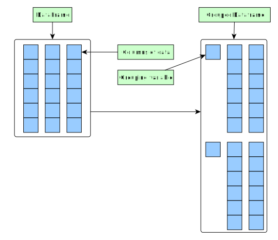
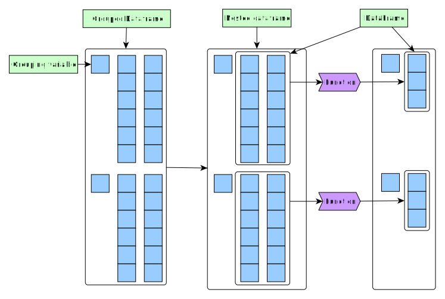

===================
Chapter 3: Modeling
===================

*****************
Types of modeling
*****************

In this chapter we will focus on doing modeling on our datasets. In our case
the term "modeling" refers to any activity that takes in our data and produces
a result. We'll be doing four differing types of modeling:

1. Creating summaries of our data by calculating statistics
   (e.g. mean, variance).
2. Fitting a function into our data.
3. Using bootstrapping methods to calculate statistical moments.
4. Running a machine learning model with training and test steps.

To accomplish these task, we'll be using various features of our frameworks:

1. Groupings - Grouping data by a common variable for efficient summaries and
   plotting.
2. Apply- and map-functions - Functions that run a function for all rows of
   our data structure.
3. Nesting/stacking - Storing data frames in our data frames.

**********************************
Grouping data by a common variable
**********************************

Description of data - Triton cluster file statistics
====================================================

In grouping one determines one or more variables to use as grouping index and
then these indices are used to apply some function to each subgroup. They are
especially useful when one is calculating some statistics from each subgroup,
doing multiple plots or determining plot colors.

This can be visualized in the following way:

Let's consider the dataset presented below. It is contains the number of files
stored on Aalto University's Triton cluster's file system. Columns are:

- File size rounded down to the nearest exponent of 2 (e.g. 3 MB file would
  be counted to row with size 2097152 (2^21 = 2097152))
- File modification date in months before 31.12.2020 (e.g. file written in
  3.9.2020 would be 3)
- Number of files

.. tabs::

  .. tab:: Python

    .. code-block:: python
    
        def load_filesizes(filesizes_file):
            filesizes = pd.read_table(filesizes_file, sep='\s+', names=['Bytes','MonthsTo2021', 'Files'])

            # Remove empty files
            filesizes = filesizes[filesizes.loc[:,'Bytes'] != 0]
            # Create a column for log2 of bytes
            filesizes['BytesLog2'] = np.log2(filesizes.loc[:, 'Bytes'])
            filesizes.loc[:,'BytesLog2'] = filesizes.loc[:,'BytesLog2'].astype(np.int64)
            # Determine total space S used by N files of size X during date D: S=N*X 
            filesizes['SpaceUsage'] = filesizes.loc[:,'Bytes']*filesizes.loc[:,'Files']
            # Determine file year and month from the MonthsTo2021-column
            filesizes['TotalMonths'] = 2021*12 - filesizes['MonthsTo2021'] - 1
            filesizes['Year'] = filesizes['TotalMonths'] // 12
            filesizes['Month'] = filesizes['TotalMonths'] % 12 + 1
            filesizes['Day'] = 1

            # Set year for really old files and files with incorrect timestamps
            invalid_years = (filesizes['Year'] < 2010) | (filesizes['Year'] > 2020)
            filesizes.loc[invalid_years, ['Year','Month']] = np.NaN

            # Get month names for the correct ordering of Month categories
            month_names = pd.date_range(start='2000-01', freq='M', periods=12).month_name()
            # Create Date
            filesizes['Date'] = pd.to_datetime(filesizes[['Year', 'Month', 'Day']])
            # Set Month
            filesizes['Month'] = pd.Categorical(filesizes['Date'].dt.month_name(), categories=month_names, ordered=True)
            # Set Month to be an ordered categorical with predefined levels 
            filesizes['Month'] = pd.Categorical(filesizes['Month'], categories=month_names, ordered=True)
            # Sort data based on Date and BytesLog2
            filesizes.sort_values(['Date','BytesLog2'], inplace=True)
            # Remove old columns
            filesizes.drop(['MonthsTo2021','TotalMonths', 'Day'], axis=1, inplace=True)
            return filesizes

        filesizes = load_filesizes('../data/filesizes_timestamps.txt')
        filesizes.head()
        
         	Bytes 	Files 	BytesLog2 	SpaceUsage 	Year 	Month 	Date
        287 	1 	5 	0 	5 	2010.0 	January 	2010-01-01
        451 	2 	3 	1 	6 	2010.0 	January 	2010-01-01
        627 	4 	27 	2 	108 	2010.0 	January 	2010-01-01
        822 	8 	136 	3 	1088 	2010.0 	January 	2010-01-01
        1057 	16 	208 	4 	3328 	2010.0 	January 	2010-01-01

  .. tab:: R

    .. code-block:: R

        load_filesizes <- function(filesizes_file){
            filesizes <- read_table2(filesizes_file, col_names=c('Bytes','MonthsTo2021', 'Files'))

            filesizes <- filesizes %>%
                # Remove empty files
                filter(Bytes != 0) %>%
                # Create a column for log2 of bytes
                mutate(BytesLog2 = log2(Bytes)) %>%
                # Determine total space S used by N files of size X during date D: S=N*X 
                mutate(SpaceUsage = Bytes*Files) %>%
                # Determine file year and month from the MonthsTo2021-column
                mutate(
                    TotalMonths = 2021*12 - MonthsTo2021 - 1,
                    Year = TotalMonths %/% 12,
                    Month = TotalMonths %% 12 +1,
                    Day = 1
                )

             # Set year for really old files and files with incorrect timestamps
            invalid_years = c((filesizes['Year'] < 2010) | (filesizes['Year'] > 2020))
            filesizes[invalid_years, c('Year','Month')] <- NaN

            # Get month names for the correct ordering of Month categories
            month_names <- month(seq(1,12), label=TRUE, locale='C')
            filesizes <- filesizes %>%
                mutate(
                    # Create Date and get the name for the month
                    Date = make_datetime(Year, Month, Day),
                    # Set Month 
                    Month=month(Month, label=TRUE, locale='C'),
                    # Set Month to be an ordered categorical with predefined levels 
                    Month=factor(Month, ordered=TRUE, levels=month_names))
            filesizes <- filesizes %>%
                # Sort data based on Date and BytesLog2
                arrange(Date, BytesLog2) %>%
                # Remove old columns
                select(-MonthsTo2021,-TotalMonths,-Day)
            return(filesizes)
        }

        filesizes <- load_filesizes('../data/filesizes_timestamps.txt')
        head(filesizes)
        
        Parsed with column specification:
        cols(
          Bytes = col_double(),
          MonthsTo2021 = col_double(),
          Files = col_double()
        )

        A tibble: 6 × 7 Bytes	Files	BytesLog2	SpaceUsage	Year	Month	Date
        <dbl>	<dbl>	<dbl>	<dbl>	<dbl>	<ord>	<dttm>
        1	5	0	5	2010	Jan	2010-01-01
        2	3	1	6	2010	Jan	2010-01-01
        4	27	2	108	2010	Jan	2010-01-01
        8	136	3	1088	2010	Jan	2010-01-01
        16	208	4	3328	2010	Jan	2010-01-01
        32	653	5	20896	2010	Jan	2010-01-01

Simple groupings and summaries - Calculating new files per year
===============================================================

Our parsed file contains columns for date, year, month, month name, the size of
files in two different formats, the number of files and the total space used by
the files. Let's say we're interested in the how the number of file has
increased each year. To do this, we'll first limit our focus on the relevant
columns.

.. tabs::

  .. tab:: Python

    .. code-block:: python
    
        # Drop rows with NaNs (invalid years)
        newfiles_relevant = filesizes.dropna(axis=0)
        # Pick relevant columns
        newfiles_relevant = newfiles_relevant.loc[:,['Year','Files']]
        newfiles_relevant.head()
        
         	Year 	Files
        287 	2010.0 	5
        451 	2010.0 	3
        627 	2010.0 	27
        822 	2010.0 	136
        1057 	2010.0 	208

  .. tab:: R

    .. code-block:: R
    
        newfiles_relevant <- filesizes %>%
            # Drop rows with NaNs (invalid years)
            drop_na() %>%
            # Pick relevant columns
            select(Year, Files) %>%
            # Change year to category for prettier plotting
            mutate(Year=as.factor(Year))
        head(newfiles_relevant)
        
         A tibble: 6 × 2 Year	Files
        <fct>	<dbl>
        2010	5
        2010	3
        2010	27
        2010	136
        2010	208
        2010	653

Now, we'll want to group our data based on the year-column (``Year``) and
calculate the total number of files (``Files``) across all rows (all dates
and files sizes).

.. tabs::

  .. tab:: Python

    .. code-block:: python
    
        print(newfiles_relevant.shape)

        newfiles_yearly_sum = newfiles_relevant.groupby('Year').agg('sum')

        print(newfiles_yearly_sum.shape)
        newfiles_yearly_sum.head()
        
        (4698, 2)
        (11, 1)

            Files
        Year 	
        2010.0 	5590287
        2011.0 	13197038
        2012.0 	17099900
        2013.0 	14755151
        2014.0 	26329321

  .. tab:: R

    .. code-block:: R

        glimpse(newfiles_relevant)

        newfiles_yearly_sum <- newfiles_relevant %>%
            group_by(Year) %>%
            summarize(Files=sum(Files))

        glimpse(newfiles_yearly_sum)
        head(newfiles_yearly_sum)
        
        Year	Files
        2010 	5590287
        2011 	13197038
        2012 	17099900
        2013 	14755151
        2014 	26329321
        2015 	24896331

In Python we see that the output of 
`agg <https://pandas.pydata.org/pandas-docs/stable/reference/api/pandas.DataFrame.agg.html>`_
is still grouped and for plotting, we'll want
to reset the grouping. R
`summarise <https://dplyr.tidyverse.org/reference/summarise.html>`_
removes the last layer of groupings, but let's
verify that the data is ungrouped.

.. tabs::

  .. tab:: Python

    .. code-block:: python
    
        newfiles_yearly_sum.reset_index(inplace=True)

        newfiles_yearly_sum.head()
        
         	Year 	Files
        0 	2010.0 	5590287
        1 	2011.0 	13197038
        2 	2012.0 	17099900
        3 	2013.0 	14755151
        4 	2014.0 	26329321

  .. tab:: R

    .. code-block:: R

        newfiles_yearly_sum <- newfiles_yearly_sum %>%
            ungroup()

        head(newfiles_yearly_sum)
        
         Year	Files
        2010 	5590287
        2011 	13197038
        2012 	17099900
        2013 	14755151
        2014 	26329321
        2015 	24896331

Let's plot this data in a bar plot:

.. tabs::

  .. tab:: Python

    .. code-block:: python
    
        newfiles_yearly_sum['Year'] = newfiles_yearly_sum['Year'].astype(int).astype('category')
        sb.barplot(x='Year', y='Files', data=newfiles_yearly_sum, ci=None)
        
    .. image:: images/newfiles_yearly_sum_python.svg

  .. tab:: R

    .. code-block:: R

        options(repr.plot.width=8, repr.plot.height=4)

        newfiles_yearly_sum %>%
            ggplot(aes(x=Year, y=Files, fill=Year)) +
            geom_col()

    .. image:: images/newfiles_yearly_sum_r.svg

Creating a function for many different summaries
================================================

Let's create a function for this workflow so that we can easily do similar
calculations with various different groups.

.. tabs::

  .. tab:: Python

    .. code-block:: python

        def aggregate_filesize_data(data, groupings, targets, agg_function):
            # Drop rows with NaNs (invalid years)
            data_relevant = data.dropna(axis=0)
            # Pick relevant columns
            data_relevant = data_relevant.loc[:, groupings + targets]
            # Change grouping to category for prettier plotting
            data_relevant[groupings] = data_relevant[groupings].astype('category')

            # Aggregate data
            data_aggregated = data_relevant.groupby(groupings).agg(agg_function).reset_index()
            return data_aggregated

        newfiles_yearly_sum = aggregate_filesize_data(filesizes, ['Year'], ['Files'], 'sum')
        newfiles_yearly_sum.head()
        
         	Year 	Files
        0 	2010.0 	5590287
        1 	2011.0 	13197038
        2 	2012.0 	17099900
        3 	2013.0 	14755151
        4 	2014.0 	26329321

  .. tab:: R

    .. code-block:: R

        aggregate_filesize_data <- function(data, grouping, target, agg_function) {
            data_relevant <- data %>%
                # Drop rows with NaNs (invalid years)
                drop_na() %>%
                # Pick relevant columns
                select_at(vars(c(grouping, target))) %>%
                # Change grouping to category for prettier plotting
                mutate_at(vars(grouping), as.factor)

            # Aggregate data
            data_aggregated <- data_relevant %>%
                group_by_at((grouping)) %>%
                summarize_at(vars(target), agg_function) %>%
                ungroup()

            return(data_aggregated)
        }

        newfiles_yearly_sum <- aggregate_filesize_data(filesizes, c('Year'), c('Files'), sum)
        head(newfiles_yearly_sum)
        
         Year	Files
        2010 	5590287
        2011 	13197038
        2012 	17099900
        2013 	14755151
        2014 	26329321
        2015 	24896331

Now we can use this function to create the following plots:

- Yearly new files
- Yearly new file space usage
- Monthly new files
- Monthly new file space usage

From these we can see the following:

- Both the number of files and the space usage are growing non-linearly as the
  number of new files and number of new bytes used are growing linearly. 
- July seems to be the month when a lot of new files are created, but it
  is not the month when the largest files are created. Something strange is
  definitely happening there.

.. tabs::

  .. tab:: Python

    .. code-block:: python
    
        yearly_sum = aggregate_filesize_data(filesizes, ['Year'], ['Files', 'SpaceUsage'], 'sum')
        monthly_sum = aggregate_filesize_data(filesizes, ['Month'], ['Files', 'SpaceUsage'], 'sum')

        yearly_sum['Year'] = yearly_sum['Year'].astype(int).astype('category')

        print(yearly_sum.head())
        print(monthly_sum.head())

        fig, ((ax1, ax2, ax3, ax4))=plt.subplots(nrows=4, figsize=(8,16))
        sb.barplot(x='Year', y='Files', data=yearly_sum, ci=None, ax=ax1)
        sb.barplot(x='Year', y='SpaceUsage', data=yearly_sum, ci=None, ax=ax2)
        sb.barplot(x='Month', y='Files', data=monthly_sum, ci=None, ax=ax3)
        sb.barplot(x='Month', y='SpaceUsage', data=monthly_sum, ci=None, ax=ax4)
        plt.tight_layout()
        
           Year     Files      SpaceUsage
        0  2010   5590287   2260716407068
        1  2011  13197038   7000732111463
        2  2012  17099900  15475575370580
        3  2013  14755151  15445375302767
        4  2014  26329321  42530364324322
              Month     Files      SpaceUsage
        0   January  34921070  43131219269056
        1  February  35707864  71022501061692
        2     March  25494722  56516865081262
        3     April  31224476  75382094990077
        4       May  37816173  75338621861676

    .. image:: images/newall_python.svg

  .. tab:: R

    .. code-block:: R

        yearly_sum <- aggregate_filesize_data(filesizes, c('Year'), c('Files', 'SpaceUsage'), sum)
        monthly_sum <- aggregate_filesize_data(filesizes, c('Month'), c('Files', 'SpaceUsage'), sum)

        head(yearly_sum)
        head(monthly_sum)

        print(yearly_sum %>%
            ggplot(aes(x=Year, y=Files, fill=Year)) +
            geom_col())
        print(yearly_sum %>%
            ggplot(aes(x=Year, y=SpaceUsage, fill=Year)) +
            geom_col())
        print(monthly_sum %>%
            ggplot(aes(x=Month, y=Files, fill=Month)) +
            geom_col())
        print(monthly_sum %>%
            ggplot(aes(x=Month, y=SpaceUsage, fill=Month)) +
            geom_col())
            
        Year	Files	SpaceUsage
        2010 	5590287 	2,260716e+12
        2011 	13197038 	7,000732e+12
        2012 	17099900 	1,547558e+13
        2013 	14755151 	1,544538e+13
        2014 	26329321 	4,253036e+13
        2015 	24896331 	3,096538e+13
        Month	Files	SpaceUsage
        Jan 	34921070 	4,313122e+13
        Feb 	35707864 	7,102250e+13
        Mar 	25494722 	5,651687e+13
        Apr 	31224476 	7,538209e+13
        May 	37816173 	7,533862e+13
        Jun 	33804495 	7,010947e+13

    .. image:: images/newall1_r.svg
    .. image:: images/newall2_r.svg
    .. image:: images/newall3_r.svg
    .. image:: images/newall4_r.svg

*********************************************************************************
Using bootstrapping/resampling methods for the calculation of statistical moments
*********************************************************************************

Quick overview of bootstrapping
===============================

`Bootstrapping methods <https://en.wikipedia.org/wiki/Bootstrapping_(statistics)>`_
are commonly used to calculate statistical moments (mean, variance, etc.) from
a sample distribution obtained from raw data.

The basic idea of bootstrapping methods is that if you have a sample
distribution and you want to calculate e.g. distribution for the sample mean,
you can take lots of resamples from the distribution with replacement and
calculate means for those resamples. Now the distribution of these means
will approach the distribution of the sample mean due to the
`law of large numbers <https://en.wikipedia.org/wiki/Law_of_large_numbers>`_.

Let's use these methods to calculate the mean file size. First, we need to get
a grouping based on both ``Year`` and ``BytesLog2``.

.. tabs::

  .. tab:: Python

    .. code-block:: python
    
        # Drop rows with NaNs (invalid years)
        newfiles_relevant2 = filesizes.dropna(axis=0)
        # Pick relevant columns
        newfiles_relevant2 = newfiles_relevant2.loc[:,['Year','BytesLog2','Files']]
        # Aggregate based on Year and BytesLog2
        newfiles_yearly_sum2 = newfiles_relevant2.groupby(['Year','BytesLog2']).agg('sum')

        newfiles_yearly_sum2.head()
        
         		Files
        Year 	BytesLog2 	
        2010.0 	0 	124
                1 	1632
                2 	5626
                3 	26287
                4 	65074

  .. tab:: R

    .. code-block:: R

        newfiles_relevant2 <- filesizes %>%
            # Drop rows with NaNs (invalid years)
            drop_na() %>%
            # Pick relevant columns
            select(Year, BytesLog2, Files) %>%
            # Aggregate based on Year and BytesLog2
            group_by(Year, BytesLog2) %>%
            summarize(Files=sum(Files))

        head(newfiles_relevant2)
        
        Year	BytesLog2	Files
        2010 	0 	124
        2010 	1 	1632
        2010 	2 	5626
        2010 	3 	26287
        2010 	4 	65074
        2010 	5 	202543

From here we can see that our data is grouped in two different layers: first
in terms of ``Year`` and then in terms of ``BytesLog2``. Summation is
afterwards done for ``Files``.

Now we can notice that because our function ``aggregate_filesize_data`` took
its arguments as lists, we can use it to do these aggregations as well. We can
use it to get our aggregated data and plot the size distribution of new files
for year 2020:

.. tabs::

  .. tab:: Python

    .. code-block:: python
    
        yearly_bytes_sum = aggregate_filesize_data(filesizes, ['Year','BytesLog2'], ['Files', 'SpaceUsage'], 'sum')

        bytes_2020 = yearly_bytes_sum[yearly_bytes_sum['Year'] == 2020]

        plt.figure(figsize=(12,6))
        sb.barplot(x='BytesLog2', y='Files', data=bytes_2020, ci=None)
        plt.title(2020)
        plt.tight_layout()
        
    .. image:: images/file-distribution-2020_python.svg

  .. tab:: R

    .. code-block:: R

        yearly_bytes_sum = aggregate_filesize_data(filesizes, c('Year','BytesLog2'), c('Files', 'SpaceUsage'), sum)

        bytes_2020 <- yearly_bytes_sum %>%
            filter(Year == 2020)

        bytes_2020 %>%
            ggplot(aes(x=BytesLog2, y=Files, fill=BytesLog2)) +
            geom_col() +
            theme(legend.position = "none")
    
    .. image:: images/file-distribution-2020_r.svg

Let's use
`np.random.choice <https://docs.scipy.org/doc/numpy-1.15.0/reference/generated/numpy.random.choice.html#numpy.random.choice>`_
(Python) /
`sample <https://www.rdocumentation.org/packages/base/versions/3.6.2/topics/sample>`_
(R) for the sampling because these functions are much faster when we're creating
hundreds to thousands of samples (resampling functions of Pandas/Tidyverse are
designed for few random samples).

Now we'll want to pick from all available byte sizes with replacement (each
byte size can be picked more than once) and we'll want to weight the picking
probabilities with the distribution of our sample data (new files created on
2020).

.. tabs::

  .. tab:: Python

    .. code-block:: python
    
        # Pick target data column and convert it to integer
        target_data = bytes_2020['BytesLog2'].copy().astype('int')
        # Pick weight data column
        weight_data = bytes_2020['Files'].copy()

        # IMPORTANT:
        #    There might be categories in BytesLog2 that do not contain any data.
        #    We'll have to fill zeros to those rows of Files.
        weight_data.fillna(0, inplace=True)

        # Normalize weight_data into probabilities
        weight_data = weight_data/weight_data.sum()

        print(target_data.head())
        print(weight_data.head())
        
        430    0
        431    1
        432    2
        433    3
        434    4
        Name: BytesLog2, dtype: int64
        430    0.000327
        431    0.001940
        432    0.001471
        433    0.007406
        434    0.014570
        Name: Files, dtype: float64

  .. tab:: R

    .. code-block:: R

        # Pick target data column and convert it to integer
        # IMPORTANT:
        #    Do notice that we'll have to first convert our target
        #    into characters as we do not want convert factor ENCODING,
        #    but the actual decoded DATA
        target_data <- as.numeric(as.character(bytes_2020[['BytesLog2']]))

        # Pick weight data column
        weight_data <- bytes_2020[['Files']]

        # Normalize weight_data into probabilities
        weight_data <- weight_data/sum(weight_data)

        print(head(target_data))
        print(head(weight_data))
        
        [1] 0 1 2 3 4 5
        [1] 0,0003271367 0,0019404559 0,0014705603 0,0074056601 0,0145700668
        [6] 0,0156263905

Now we can create a vector of means and fill it with random resampled means.
The sample mean of our original distribution is then the mean of this vector.
By looking at our plot we can see that the sample mean corresponds well with
the peak of the distribution.

.. tabs::

  .. tab:: Python

    .. code-block:: python
    
        # Create means vector
        means = np.zeros(10, dtype=np.float64)
        for i in range(10):
            # Calculate resampled mean
            means[i] = np.mean(np.random.choice(target_data, 100, replace=True, p=weight_data))
        means = pd.Series({'SampledMeans': means})
        print(means.head())
        print('Estimated sample mean:', means['SampledMeans'].mean())
        
        SampledMeans    [13.96, 13.37, 13.03, 13.17, 13.17, 12.76, 12....
        dtype: object
        Estimated sample mean: 13.222

  .. tab:: R

    .. code-block:: R

        # Create means vector
        means <- numeric(10)
        for (i in seq(10)) {
            # Calculate resampled mean
            means[[i]] <- mean(sample(target_data, 100, replace=TRUE, prob=weight_data))
        }
        print(means)
        print(paste0('Estimated sample mean: ', mean(means)))
        
        [1] 12,19 12,19 12,80 12,90 13,18 13,48 12,97 12,39 13,49 12,57
        [1] "Estimated sample mean: 12,816"

Let's now create a function for this bootstrapping feature:

.. tabs::

  .. tab:: Python

    .. code-block:: python
    
        def get_bootstrapped_means(dataset, target_col, weight_col, n_means=1000):
            # Pick relevant columns
            df = dataset[[target_col, weight_col]].copy()
            # Pick target data column
            target_data = df[target_col]
            # Pick weight data column
            weight_data = df[weight_col]
            # Fill zeros to those byte sizes that are not present in the Files-data
            weight_data.fillna(0, inplace=True)
            # Normalize weight_data into probabilities
            weight_data = weight_data/weight_data.sum()

            # Create means vector
            means = np.zeros(n_means, dtype=np.float64)
            for i in range(n_means):
                # Calculate resampled mean
                means[i] = np.mean(np.random.choice(target_data, 100, replace=True, p=weight_data))

            # Store results as a DataFrame
            means = pd.Series({'SampledMeans': means})

            return means

        bootstrapped_means = get_bootstrapped_means(bytes_2020, 'BytesLog2', 'Files', n_means=1000)
        print(bootstrapped_means.head())
        print('Estimated sample mean:', bootstrapped_means['SampledMeans'].mean())
        
        SampledMeans    [13.8, 13.03, 13.42, 13.02, 13.42, 12.69, 13.7...
        dtype: object
        Estimated sample mean: 13.194700000000001

  .. tab:: R

    .. code-block:: R

        get_bootstrapped_means <- function(dataset, target_col, weight_col, n_means=1000) {
            # Pick relevant columns
            # Pick target data column and convert it to integer
            target_data <- as.numeric(as.character(dataset[[target_col]]))
            # Pick weight data column
            weight_data <- dataset[[weight_col]]
            weight_data <- weight_data/sum(weight_data)

            # Create means vector
            means <- numeric(n_means)
            for (i in seq(n_means)) {
                # Calculate resampled mean
                means[[i]] <- mean(sample(target_data, 100, replace=TRUE, prob=weight_data))
            }
            means <- tibble(SampledMeans=means)
            return(means)
        }

        means <- get_bootstrapped_means(bytes_2020, 'BytesLog2', 'Files', n_means=1000)
        print(head(means))
        print(paste0('Estimated sample mean: ', mean(means[['SampledMeans']])))

Using nested dataframes to help with bootstrapping
==================================================

Models that need multiple columns (or even the full dataset), but need to be
grouped along some column, are usually easier to run using nested dataframes.
When using nested dataframes we split our initial data based on a grouping and
apply some function for each of these dataframes. The result of this function
can be a dataframe.

This can be visualized in the following way:

Let's use our data (``yearly_bytes_sum``) and let's create bootstrapped means
for all of the years using nested dataframes.

.. tabs::

  .. tab:: Python

    .. code-block:: python
    
        bootstrapped_means = yearly_bytes_sum.groupby('Year').apply(lambda x: get_bootstrapped_means(x, 'BytesLog2', 'Files', n_means=5))
        bootstrapped_means.head()
        
         	SampledMeans
        Year 	
        2010.0 	[13.07, 13.32, 13.34, 12.34, 13.03]
        2011.0 	[13.73, 14.56, 14.2, 13.89, 13.71]
        2012.0 	[9.9, 9.73, 10.42, 10.63, 10.59]
        2013.0 	[13.52, 13.35, 13.14, 13.22, 14.02]
        2014.0 	[14.01, 14.49, 13.68, 14.05, 13.72]

  .. tab:: R

    .. code-block:: R

        yearly_bytes_sum_nested <- yearly_bytes_sum %>%
            group_by(Year) %>%
            nest()

        print(glimpse(yearly_bytes_sum_nested))

        bootstrapped_means <- yearly_bytes_sum_nested %>%
            mutate(SampledMeans=map(data, function(x) get_bootstrapped_means(x, 'BytesLog2', 'Files', n_means=100))) %>%
            select(-data)

        print(glimpse(bootstrapped_means))
        head(bootstrapped_means,1)
        
        # A tibble: 6 x 1
          SampledMeans
                 <dbl>
        1         14.0
        2         12.9
        3         13.5
        4         12.9
        5         13.2
        6         12.9
        [1] "Estimated sample mean: 13,2043"

Now we can calculate means for each of these bootstrapped means:

.. tabs::

  .. tab:: Python

    .. code-block:: python

        bootstrapped_means['Mean'] = bootstrapped_means['SampledMeans'].apply(np.mean)
        bootstrapped_means.head()
        
         	SampledMeans 	Mean
        Year 		
        2010.0 	[13.07, 13.32, 13.34, 12.34, 13.03] 	13.020
        2011.0 	[13.73, 14.56, 14.2, 13.89, 13.71] 	14.018
        2012.0 	[9.9, 9.73, 10.42, 10.63, 10.59] 	10.254
        2013.0 	[13.52, 13.35, 13.14, 13.22, 14.02] 	13.450
        2014.0 	[14.01, 14.49, 13.68, 14.05, 13.72] 	13.990

  .. tab:: R

    .. code-block:: R

        bootstrapped_means <- bootstrapped_means  %>%
            mutate(Means=map(SampledMeans, function(x) mean(x[['SampledMeans']])))

        print(glimpse(bootstrapped_means))
        head(bootstrapped_means, 1)
        
        Observations: 11
        Variables: 2
        $ Year <fct> 2010, 2011, 2012, 2013, 2014, 2015, 2016, 2017, 2018, 2019, 2020
        $ data <list> [<tbl_df[37 x 3]>, <tbl_df[37 x 3]>, <tbl_df[38 x 3]>, <tbl_df[…
        # A tibble: 11 x 2
           Year  data             
           <fct> <list>           
         1 2010  <tibble [37 × 3]>
         2 2011  <tibble [37 × 3]>
         3 2012  <tibble [38 × 3]>
         4 2013  <tibble [38 × 3]>
         5 2014  <tibble [40 × 3]>
         6 2015  <tibble [40 × 3]>
         7 2016  <tibble [40 × 3]>
         8 2017  <tibble [40 × 3]>
         9 2018  <tibble [42 × 3]>
        10 2019  <tibble [40 × 3]>
        11 2020  <tibble [42 × 3]>
        Observations: 11
        Variables: 2
        $ Year         <fct> 2010, 2011, 2012, 2013, 2014, 2015, 2016, 2017, 2018, 20…
        $ SampledMeans <list> [<tbl_df[100 x 1]>, <tbl_df[100 x 1]>, <tbl_df[100 x 1]…
        # A tibble: 11 x 2
           Year  SampledMeans      
           <fct> <list>            
         1 2010  <tibble [100 × 1]>
         2 2011  <tibble [100 × 1]>
         3 2012  <tibble [100 × 1]>
         4 2013  <tibble [100 × 1]>
         5 2014  <tibble [100 × 1]>
         6 2015  <tibble [100 × 1]>
         7 2016  <tibble [100 × 1]>
         8 2017  <tibble [100 × 1]>
         9 2018  <tibble [100 × 1]>
        10 2019  <tibble [100 × 1]>
        11 2020  <tibble [100 × 1]>

        Year	SampledMeans
        2010 	13,06, 13,10, 13,90, 13,23, 12,39, 13,28, 12,81, 12,86, 12,96, 12,66, 13,48, 12,94, 12,81, 13,49, 13,32, 12,55, 13,28, 11,99, 13,17, 13,04, 12,63, 12,92, 13,11, 13,30, 13,33, 12,99, 12,88, 13,23, 13,54, 14,06, 13,26, 13,36, 13,10, 13,26, 13,80, 12,83, 13,29, 12,87, 12,48, 12,81, 12,37, 12,20, 12,52, 12,21, 13,26, 12,14, 13,31, 13,38, 13,13, 13,19, 12,68, 13,16, 13,34, 12,65, 13,16, 13,36, 13,29, 13,00, 13,48, 12,89, 12,51, 12,64, 12,78, 12,72, 12,51, 12,81, 13,54, 12,85, 13,24, 13,23, 12,98, 13,38, 12,12, 13,31, 13,09, 13,17, 13,32, 13,21, 13,23, 13,51, 13,73, 13,56, 12,72, 12,77, 12,84, 12,33, 12,20, 13,12, 12,05, 12,15, 13,20, 14,03, 13,19, 13,05, 13,08, 13,31, 12,93, 13,25, 13,48, 12,77

Let's create a function for this procedure so that we can run it for multiple
different columns:

.. tabs::

  .. tab:: Python

    .. code-block:: python
    
        def bootstrap_byteslog2_mean(dataset, group_variable, target_variable, n_means=1000):

            bootstrapping_function = lambda x: get_bootstrapped_means(x, 'BytesLog2', target_variable, n_means=n_means)

            bootstrapped_means = dataset.groupby(group_variable).apply(bootstrapping_function)
            bootstrapped_means['Mean'] = bootstrapped_means['SampledMeans'].apply(np.mean)
            return bootstrapped_means

        bootstrapped_yearly_means = bootstrap_byteslog2_mean(yearly_bytes_sum, 'Year', 'Files', n_means=1000)
        bootstrapped_yearly_means.head()
        
                    SampledMeans 	Mean
        Year 		
        2010.0 	[12.55, 12.83, 14.01, 12.28, 12.86, 13.04, 13.... 	12.97764
        2011.0 	[14.27, 14.27, 13.89, 13.97, 13.81, 13.76, 13.... 	14.05083
        2012.0 	[10.69, 10.88, 11.12, 10.09, 11.15, 10.84, 10.... 	10.65042
        2013.0 	[13.39, 13.01, 13.22, 13.61, 12.81, 12.82, 13.... 	13.39958
        2014.0 	[14.04, 13.96, 14.5, 13.21, 13.64, 14.68, 14.3... 	14.03843

  .. tab:: R

    .. code-block:: R

        bootstrap_byteslog2_mean <- function(dataset, group_variable, target_variable, n_means=1000) {

            bootstrapping_function <- function(x) get_bootstrapped_means(x, 'BytesLog2', target_variable, n_means=n_means)

            bootstrapped_means <- dataset %>%
                group_by_at(vars(group_variable)) %>%
                nest() %>%
                mutate(
                    SampledMeans=map(data, bootstrapping_function),
                    Means=map(SampledMeans, function(x) mean(x[['SampledMeans']]))) %>%
                select(-data)

            return(bootstrapped_means)
        }

        bootstrapped_yearly_means = bootstrap_byteslog2_mean(yearly_bytes_sum, 'Year', 'Files', n_means=1000)
        glimpse(bootstrapped_yearly_means)
        
        Observations: 11
        Variables: 3
        $ Year         <fct> 2010, 2011, 2012, 2013, 2014, 2015, 2016, 2017, 2018, 20…
        $ SampledMeans <list> [<tbl_df[1000 x 1]>, <tbl_df[1000 x 1]>, <tbl_df[1000 x…
        $ Means        <list> [12,96696, 14,04812, 10,67652, 13,39827, 14,02425, 11,7…

For plotting we can unstack the ``SampledMeans``-dataframe.

.. tabs::

  .. tab:: Python

    .. code-block:: python
    
        bootstrapped_yearly_means_distribution = bootstrapped_yearly_means.drop('Mean', axis=1).explode('SampledMeans').reset_index()

        bootstrapped_yearly_means_distribution.head()
        
         	Year 	SampledMeans
        0 	2010.0 	12.55
        1 	2010.0 	12.83
        2 	2010.0 	14.01
        3 	2010.0 	12.28
        4 	2010.0 	12.86

  .. tab:: R

    .. code-block:: R

        bootstrapped_yearly_means_distribution <- bootstrapped_yearly_means %>%
            select(-Means) %>%
            unnest()

        head(bootstrapped_yearly_means_distribution)

        Year	SampledMeans
        2010 	13,29
        2010 	13,01
        2010 	13,28
        2010 	12,40
        2010 	13,26
        2010 	12,76

Now we can plot distributions for the data and for the sample mean.

.. tabs::

  .. tab:: Python

    .. code-block:: python
    
        for (year, real_data), (year_sampled, bootstrapped_data) in zip(yearly_bytes_sum.groupby('Year'), bootstrapped_yearly_means_distribution.groupby('Year')):
            figure, (ax1, ax2) = plt.subplots(1,2,figsize=(16,3))
            figure.suptitle(int(year))
            sb.barplot(x='BytesLog2', y='Files', data=real_data, ci=None, ax=ax1)
            sb.histplot(x='SampledMeans', binwidth=0.5, data=bootstrapped_data, ax=ax2)
            plt.xlim(left=min(yearly_bytes_sum['BytesLog2']), right=max(yearly_bytes_sum['BytesLog2']))
            plt.tight_layout()
        
    .. image:: images/file-distributions-2010_python.svg
    .. image:: images/file-distributions-2011_python.svg
    .. image:: images/file-distributions-2012_python.svg
    .. image:: images/file-distributions-2013_python.svg
    .. image:: images/file-distributions-2014_python.svg
    .. image:: images/file-distributions-2015_python.svg
    .. image:: images/file-distributions-2016_python.svg
    .. image:: images/file-distributions-2017_python.svg
    .. image:: images/file-distributions-2018_python.svg
    .. image:: images/file-distributions-2019_python.svg
    .. image:: images/file-distributions-2020_python.svg

  .. tab:: R

    .. code-block:: R

        options(repr.plot.width=8, repr.plot.height=16)

        x_limits <- range(as.numeric(levels(yearly_bytes_sum[['BytesLog2']])))

        yearly_bytes_sum %>%
            ggplot(aes(x=as.factor(BytesLog2), y=Files, fill=Year)) +
                geom_bar(stat='identity') +
                ylab('N') +
                xlab('Bytes (log2)') +
                ggtitle('Yearly files') +
                facet_grid(rows=vars(Year))

        bootstrapped_yearly_means_distribution %>%
            ggplot(aes(x=SampledMeans, fill=Year)) +
                geom_histogram(binwidth=0.1) +
                ylab('Number of bootstrapped means') +
                xlab('Mean of Bytes (log2)') +
                xlim(x_limits) +
                ggtitle('Distribution of means') +
                facet_grid(rows=vars(Year))

    .. image:: images/yearly-file-distributions_r.svg
    .. image:: images/yearly-mean-distributions_r.svg

Let's use our new functions for monthly data as well:

.. tabs::

  .. tab:: Python

    .. code-block:: python
    
        monthly_bytes_sum = aggregate_filesize_data(filesizes, ['Month','BytesLog2'], ['Files', 'SpaceUsage'], 'sum')
        bootstrapped_monthly_means = bootstrap_byteslog2_mean(monthly_bytes_sum, 'Month', 'Files', n_means=1000)
        bootstrapped_monthly_means_distribution = bootstrapped_monthly_means.drop('Mean', axis=1).explode('SampledMeans').reset_index()
        bootstrapped_monthly_means_distribution.head()

        for (month, real_data), (month_sampled, bootstrapped_data) in zip(monthly_bytes_sum.groupby('Month'), bootstrapped_monthly_means_distribution.groupby('Month')):
            figure, (ax1, ax2) = plt.subplots(1,2,figsize=(16,3))
            figure.suptitle(month)
            sb.barplot(x='BytesLog2', y='Files', data=real_data, ci=None, ax=ax1)
            sb.histplot(x='SampledMeans', binwidth=0.5, data=bootstrapped_data, ax=ax2)
            plt.xlim(left=min(yearly_bytes_sum['BytesLog2']), right=max(yearly_bytes_sum['BytesLog2']))
            plt.tight_layout()
        
    .. image:: images/file-distributions-January_python.svg
    .. image:: images/file-distributions-February_python.svg
    .. image:: images/file-distributions-March_python.svg
    .. image:: images/file-distributions-April_python.svg
    .. image:: images/file-distributions-May_python.svg
    .. image:: images/file-distributions-June_python.svg
    .. image:: images/file-distributions-July_python.svg
    .. image:: images/file-distributions-August_python.svg
    .. image:: images/file-distributions-September_python.svg
    .. image:: images/file-distributions-October_python.svg
    .. image:: images/file-distributions-November_python.svg
    .. image:: images/file-distributions-December_python.svg

  .. tab:: R

    .. code-block:: R

        monthly_bytes_sum <- aggregate_filesize_data(filesizes, c('Month','BytesLog2'), c('Files', 'SpaceUsage'), sum)
        bootstrapped_monthly_means = bootstrap_byteslog2_mean(monthly_bytes_sum, 'Month', 'Files', n_means=1000)
        bootstrapped_monthly_means_distribution <- bootstrapped_monthly_means %>%
            select(-Means) %>%
            unnest()

        options(repr.plot.width=10, repr.plot.height=16)

        x_limits <- range(as.numeric(levels(monthly_bytes_sum[['BytesLog2']])))

        monthly_bytes_sum %>%
            ggplot(aes(x=as.factor(BytesLog2), y=Files, fill=Month)) +
                geom_bar(stat='identity') +
                ylab('N') +
                xlab('Bytes (log2)') +
                ggtitle('Yearly files') +
                facet_grid(rows=vars(Month))

        bootstrapped_monthly_means_distribution %>%
            ggplot(aes(x=SampledMeans, fill=Month)) +
                geom_histogram(binwidth=0.1) +
                ylab('Number of bootstrapped means') +
                xlab('Mean of Bytes (log2)') +
                xlim(x_limits) +
                ggtitle('Distribution of means') +
                facet_grid(rows=vars(Month))

    .. image:: images/monthly-file-distributions_r.svg
    .. image:: images/monthly-mean-distributions_r.svg

.. tabs::

  .. tab:: Python

    .. code-block:: python
    
        pass

  .. tab:: R

    .. code-block:: R

        NULL
