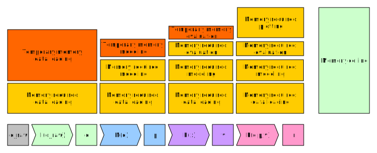

==================
Chapter 4: Scaling
==================

*******************************************************
Different resources involved in data analysis pipelines
*******************************************************

Modern data analysis pipelines can be very expensive computationally. In order
to scale these pipelines up, we'll need to first understand the resources that
these pipelines require. These resources are:

1. Processors (CPUs)
2. Memory (RAM)
3. Storage space

Let's look at them one by one. At the end we'll collect the best practices into
a table.

Processors as a resource
========================

Processor is the quintessential resource when it comes to data analysis. It
is used throughout the pipeline from data loading to data analysis and thus
it is important to know some features about them.

Cores vs threads
****************

Modern processors are built from multiple cores. Sometimes these
cores can house multiple threads. This is called hyperthreading.

We'll look at CPU parallelization techniques later on, but for now it's
important to know that the maximum number of threads/processes you should
launch on a given CPU is the number of threads/cores that are available. If you
launch a larger number, you will oversubscribe the CPUs and the code will run
slower as different threads/processes will have to swap in/out of the CPUs.

Processor cache
***************

Operations on data are done with
`instructions <https://en.wikipedia.org/wiki/Instruction_set_architecture>`_
inside the cores. These instructions do calculations such as addition,
multiplication etc.. However, in order to get maximum throughput of finished
instructions, all modern CPU architectures have multiple layers of data caching
and prefetching that try to keep the calculating parts of the CPU as busy as
possible.

Data is read to the cache in blocks of data called cache lines. If required data
is not found in the cache, the data needs to be loaded from the system RAM,
which results in a significant performance penalty. This is called a
`cache miss <https://en.wikipedia.org/wiki/CPU_cache#Cache_miss>`_.

.. image:: images/processor-cache.svg
    :align: center

This caching procedure can be helped by keeping the data in memory as a
contiguous array. Both R vectors and numpy ndarrays are contiguous. They have
so-called
`row-major-ordering <https://en.wikipedia.org/wiki/Row-_and_column-major_order>`_.
It is also important to keep this order in mind when doing operations with
multidimensional arrays.

Vectorized instructions
***********************

Another important feature of modern processors is that they support vectorized
instructions (AVX, AVX2, AVX512). These dramatically improve the performance
when one does the same operation for multiple pieces of data e.g. elementwise
addition. R, numpy and mathematical libraries that they use such as MKL, BLAS
LAPACK, FFTW etc. use these operations straight out of the box, if the program
is written to use functions from these packages.

.. image:: images/processor-avx.svg
    :align: center

We can test the effect of vectorization by looking at the following example
that adds to a zero array.

.. tabs::

  .. tab:: Python

    .. code-block:: python

        n_zeros = 10000
        ntimes = 1000

        z = np.zeros(n_zeros)

        time_for_1 = time.time()
        for t in range(ntimes):
            for i in range(n_zeros):
                z[i] = z[i] + 1
        time_for_2 = time.time()

        time_for = time_for_2-time_for_1

        z = np.zeros(n_zeros)

        time_vec_1 = time.time()
        for t in range(ntimes):
            z = z + 1
        time_vec_2 = time.time()

        time_vec = time_vec_2-time_vec_1

        print("""
        Time taken:

        For loop: %.2g
        Vectorized operation: %.2g

        Speedup: %.0f
        """ % (time_for, time_vec, time_for/time_vec))
        

        Time taken:

        For loop: 4.5
        Vectorized operation: 0.0056

        Speedup: 801

  .. tab:: R

    .. code-block:: R

        n_zeros <- 10000
        ntimes <- 1000

        z <- numeric(n_zeros)

        time_for_1 <- Sys.time()
        for (t in seq(ntimes)) {
            for (i in seq(1,n_zeros)) {
                z[i] <- z[i] + 1
            }
        }
        time_for_2 <- Sys.time()

        time_for <- time_for_2 - time_for_1

        z <- numeric(n_zeros)

        time_vec_1 <- Sys.time()
        for (t in seq(ntimes)) {
            z <- z + 1
        }
        time_vec_2 <- Sys.time()

        time_vec <- time_vec_2 - time_vec_1

        cat(sprintf("Time taken:\n\nFor loop: %.2g\nVectorized operation: %.2g\n\nSpeedup: %.2f", time_for, time_vec, time_for/as.double(time_vec, unit='secs')))

        
        Time taken:

        For loop: 0.61
        Vectorized operation: 0.018

        Speedup: 33.61

RAM as a resource
=================

RAM stores the data and variables that you operate on during your data
analysis workflow. From RAM the data is transferred to processor caches for
operations. In data science pipelines the biggest problem is usually that
one runs out of memory when dealing with big datasets.

Memory ceiling
**************

When thinking about memory one should always think about the ceiling of memory
usage. Let's say that during our input loading part ``I(x)`` of our pipeline
we read dataset ``d_raw`` e.g. from a csv and we convert/modify our columns
to obtain a dataset ``d``. Now the size of the memory we need is
``size(I(d_raw)) = size(d) + size(d_raw)`` and we know that this is our
memory ceiling for the data loading.

Let's say that we keep the original dataset ``d_raw`` in memory through
our full pipeline. Then the memory ceiling of ``I(x)`` becomes a floor
for the next part of our pipeline and we start to accumulate memory even
though we no longer need some of our previous objects. This is visualized
in the image below:

.. image:: images/ram-pipeline.svg
    :align: center

Calculating memory usage
************************

Let's consider
:ref:`boostrapping model <chapter-3-bootstrap>`
that the we had in chapter 3. We read our data into dataset
``filesizes`` and then used aggregation functions to create another dataset
``yearly_bytes_sum`` that we used for our bootstrapping procedure.

.. tabs::

  .. tab:: Python

    .. code-block:: python

        def chapter3_pipeline(n_means=10000):

            filesizes = load_filesizes('../data/filesizes_timestamps.txt')

            yearly_bytes_sum = aggregate_filesize_data(filesizes, ['Year','BytesLog2'], ['Files', 'SpaceUsage'], 'sum')

            bootstrapped_yearly_means = bootstrap_byteslog2_mean(yearly_bytes_sum, 'Year', 'Files', n_means=n_means)

            bootstrapped_yearly_means = bootstrapped_yearly_means.reset_index()[['Year','Mean']]

            return bootstrapped_yearly_means

        chapter3_pipeline(n_means=100).head()
        
        Year 	Mean
        0 	2010.0 	12.9242
        1 	2011.0 	14.0712
        2 	2012.0 	10.6465
        3 	2013.0 	13.3474
        4 	2014.0 	14.0410

  .. tab:: R

    .. code-block:: R

        chapter3_pipeline <- function(n_means=10000) {

            filesizes <- load_filesizes('../data/filesizes_timestamps.txt')

            yearly_bytes_sum <- aggregate_filesize_data(filesizes, c('Year','BytesLog2'), c('Files', 'SpaceUsage'), sum)

            bootstrapped_yearly_means <- yearly_bytes_sum %>%
                bootstrap_byteslog2_mean('Year', 'Files', n_means=n_means) %>%
                select(Year, Mean)

            return(bootstrapped_yearly_means)
        }

        head(chapter3_pipeline(n_means=100))

        Year	Mean
        2010 	12.9871
        2011 	14.1068
        2012 	10.7926
        2013 	13.3482
        2014 	13.9873
        2015 	11.7709

One can calculate the size of a dataset in the following fashion:

.. tabs::

  .. tab:: Python
  
    `pandas.DataFrame.memory_usage <https://pandas.pydata.org/pandas-docs/stable/reference/api/pandas.DataFrame.memory_usage.html>`_

    .. code-block:: python

        filesizes = load_filesizes('../data/filesizes_timestamps.txt')
        yearly_bytes_sum = aggregate_filesize_data(filesizes, ['Year','BytesLog2'], ['Files', 'SpaceUsage'], 'sum')
        print(filesizes.memory_usage(deep=True))
        print(yearly_bytes_sum.memory_usage(deep=True))
        filesizes_size = filesizes.memory_usage(deep=True).sum()
        summarized_size = yearly_bytes_sum.memory_usage(deep=True).sum()
        print("""
        Original data: %d bytes
        Summarized data: %d bytes

        Reduction ratio: %.2f
        """ % (filesizes_size, summarized_size, filesizes_size/summarized_size))
        
        Index         69520
        Bytes         69520
        Files         69520
        BytesLog2     69520
        SpaceUsage    69520
        Year          69520
        Month          9768
        Date          69520
        dtype: int64
        Index          128
        Year           881
        BytesLog2     2097
        Files         3784
        SpaceUsage    3784
        dtype: int64

        Original data: 496408 bytes
        Summarized data: 10674 bytes

        Reduction ratio: 46.51

  .. tab:: R
  
    `object.size <https://www.rdocumentation.org/packages/utils/versions/3.6.2/topics/object.size>`_

    .. code-block:: R

        filesizes <- load_filesizes('../data/filesizes_timestamps.txt')
        yearly_bytes_sum <- aggregate_filesize_data(filesizes, c('Year','BytesLog2'), c('Files', 'SpaceUsage'), sum)

        print_column_sizes <- function(dataset) {
            map(colnames(dataset), function(x) print(sprintf('column: %12s size: %d', x, object.size(dataset[x]))))
            invisible(NULL)
        }

        print('filesizes:')
        print_column_sizes(filesizes)

        print('yearly_bytes_sum:')
        print_column_sizes(yearly_bytes_sum)

        filesizes_size <- object.size(filesizes)
        summarized_size <- object.size(yearly_bytes_sum)

        cat(sprintf("
        Original data: %d bytes
        Summarized data: %d bytes

        Reduction ratio: %.2f
        ", filesizes_size, summarized_size, filesizes_size/summarized_size))
        
        [1] "filesizes:"
        [1] "column:        Bytes size: 70384"
        [1] "column:        Files size: 70384"
        [1] "column:    BytesLog2 size: 70392"
        [1] "column:   SpaceUsage size: 70392"
        [1] "column:         Year size: 70384"
        [1] "column:        Month size: 36872"
        [1] "column:         Date size: 70896"
        [1] "yearly_bytes_sum:"
        [1] "column:         Year size: 3728"
        [1] "column:    BytesLog2 size: 5744"
        [1] "column:        Files size: 4336"
        [1] "column:   SpaceUsage size: 4344"

        Original data: 455320 bytes
        Summarized data: 15920 bytes

        Reduction ratio: 28.60

From the output we can see the following things:

- We can reduce the memory consumption by taking only those columns we're
  interested in.
- We can reduce the memory consumption by converting data with repeating
  values into categorical type (``Year``).
- Converting numerical data with many categories (``BytesLog2``) into
  categorical type can increase memory consumption.

Garbage collector
*****************

As mentioned previously, these past datasets become increasingly important
when they are carried around throughout the pipeline. Both Python and R have
a garbage collector that runs occationally and removes unneeded memory
allocations. Each object has a reference counter that tells the garbage
collector how many times the object is referenced. Each time you e.g. assign
the object into a variable the reference counter is increased and each time
you overwrite/delete a variable the reference counter is decreased. Once it
reaches zero the garbage collector knows that the object can be removed.

To help garbage collector one can create parts of your pipeline as functions.
By writing code as function all temporary variables are created to the
function's scope (aka. environment). After the function finishes they are
no longer defined outside of the function and thus they are good for garbage
collecting.

.. tabs::

  .. tab:: Python

    .. code-block:: python

        def memory_scope_test():

            memory_scope_variable = np.random.random(1000)
            print(memory_scope_variable.nbytes)

        memory_scope_test()
        print(memory_scope_variable.nbytes)

        8000

        ---------------------------------------------------------------------------
        NameError                                 Traceback (most recent call last)
        <ipython-input-41-6d1e9e06eb99> in <module>
              5 
              6 memory_scope_test()
        ----> 7 print(memory_scope_variable.nbytes)

        NameError: name 'memory_scope_variable' is not defined

  .. tab:: R

    .. code-block:: R

        memory_scope_test <- function(){
            memory_scope_variable = runif(1000)
            print(object.size(memory_scope_variable))
        }
        memory_scope_test()
        print(object.size(memory_scope_variable))

        8048 bytes

        Error in structure(.Call(C_objectSize, x), class = "object_size"): object 'memory_scope_variable' not found
        Traceback:

        1. print(object.size(memory_scope_variable))
        2. object.size(memory_scope_variable)
        3. structure(.Call(C_objectSize, x), class = "object_size")

One can also call the garbage collector explicitly after removing a variable.
However, this should be thought as a band-aid to memory problems and should
only be used when there's an obvious target for garbage collection (e.g. some
subroutine was called and the memory used by it could be freed, a variable was
explicitly removed, etc.)

.. tabs::

  .. tab:: Python
  
    This example requires the
    `memory_profiler <https://github.com/pythonprofilers/memory_profiler>`_-package.
    It is included in the updated ``environment.yml``, but can also be installed
    by running ``pip install memory_profiler`` in a shell where the environment
    is activated.
    
    `Python's gc.collect-function <https://docs.python.org/3/library/gc.html#gc.collect>`_

    .. code-block:: python

        import gc

        def memtest_nocollect(n=1000):

            A = np.random.random(n**2)

            A_mean = np.mean(A)

            time.sleep(5)

            B = np.matrix(np.random.random((n, n)) + A_mean)
            B = B + B.T
            B_inv = np.linalg.inv(B)

            return np.max(B*B_inv)

        def memtest_collect(n=1000):

            A = np.random.random(n**2)

            A_mean = np.mean(A)

            del A
            gc.collect()

            time.sleep(5)

            B = np.matrix(np.random.random((n, n)) + A_mean)
            B = B + B.T
            B_inv = np.linalg.inv(B)

            return np.max(B*B_inv)

        print(memtest_nocollect(100), memtest_collect(100))
        
        1.0000000000000036 1.0000000000000249

    .. code-block:: python
    
        %load_ext memory_profiler

    .. code-block:: python
    
        %memit memtest_nocollect(3000)

        peak memory: 572.32 MiB, increment: 343.27 MiB

    .. code-block:: python
    
        %memit memtest_collect(3000)
        peak memory: 435.05 MiB, increment: 206.00 MiB

  .. tab:: R
  
    `R's gc-function <https://www.rdocumentation.org/packages/base/versions/3.6.2/topics/gc>`_

    .. code-block:: R

        library(pryr)

        memtest_nocollect <- function(n=1000) {

            print(mem_used())

            A <- runif(n*n)
            A_mean <- mean(A)

            print('No garbage collection done.')
            Sys.sleep(5)

            B <- matrix(runif(n*n), ncol=n)
            B <- B %*% t(B)
            B_inv <- solve(B)

            print(mem_used())

            return(max(B %*% B_inv))
        }

        memtest_collect <- function(n=1000){

            print(mem_used())

            A <- runif(n*n)
            A_mean <- mean(A)

            rm(A)
            print(gc())
            Sys.sleep(5)

            B <- matrix(runif(n*n), ncol=n)
            B <- B %*% t(B)
            B_inv <- solve(B)

            print(mem_used())

            return(max(B %*% B_inv))
        }

        memtest_nocollect(3000)
        memtest_collect(3000)
        
        62.4 MB
        [1] "No garbage collection done."
        278 MB

        1.00000010849908

        62.4 MB
                  used (Mb) gc trigger  (Mb) max used  (Mb)
        Ncells  881669 47.1    1773930  94.8  1214762  64.9
        Vcells 1626091 12.5   37149668 283.5 46639578 355.9
        206 MB

        1.00000000977889

By using these strategies we make it possible for the garbage cleaner to
release memory during pipeline's execution. This reduces our memory ceiling
considerably.

Storage as a resource
=====================

Differences in different storage solutions
******************************************

Storage solutions are often compared using the following metrics:

- Capacity - The amount of data that can be stored. This is of course important
  for data analysis problems as more capacity allows for more datasets.
- Random read/write speed - The speed of small read/write operations the
  storage system can do to at random. This is especially important when reading
  randomly from a file or when reading lots of small files.
- Sequential read/write speed - The speed of reading large chunks of data at
  once. This is very important when reading/writing datasets that are stored in
  binary data formats.
- Reliability - The reliability of the filesystem. Nothing is worse for data
  scientist than losing data.

There are multiple different types of storage systems and all of them have
different strengths and weaknesses. Some important systems are:

- Local SSDs - Most laptop and desktop computers nowadays have SSDs in them as
  their hard drives. These are very fast when it comes to disk access, but they
  usually do not have a big capacity and they are usually not backed up or
  duplicated.
- Network file system (NFS) - Commonly used as ``/home``-directory for
  universities' desktop machines. They are not the fastest when it comes to
  random or sequential access, but they usually have more capacity than
  hard drives and are backed up.
- Storage in high-performance computing (HPC) systems (Lustre etc.) - Work
  storage in HPC systems is usually designed for maximum capacity and
  maximum performance so they are ideal for large work data. They are best when
  accessed sequentially.
- Object storage systems (OpenStack, cloud) - These systems are widely used to
  store big datasets/models for cloud computing and archive data. When using
  cloud computing the compute instances usually have local SSDs and object
  storage is used for long term storage. Due to the nature of the storage
  system there is rarely any random access so all access is to complete
  objects.

Table below tries to collect some of this information:

+----------------+----------+-------------+-------------+-------------+-------------------------------+
| Storage system | Capacity || Random     || Sequential | Reliability | Best usage                    |
|                | Capacity || speed      || speed      |             |                               |
+================+==========+=============+=============+=============+===============================+
| Local SSDs     | Small    | Great       | Good        | Low         | Temporary work disk           |
+----------------+----------+-------------+-------------+-------------+-------------------------------+
| NFS            | Medium   | Slow-Medium | Slow-Medium | High        | Storing initial datasets      |
+----------------+----------+-------------+-------------+-------------+-------------------------------+
| HPC storage    | Huge     | Medium      | Great       | Medium      | Work disk for big data        |
+----------------+----------+-------------+-------------+-------------+-------------------------------+
| Object storage | Huge     | Low         | Good        | High        || Storing initial datasets,    |
|                |          |             |             |             || completed models and results |
+----------------+----------+-------------+-------------+-------------+-------------------------------+

Using storage space efficiently
*******************************

Storage is often thought of in trivial terms: do I have sufficient storage
space to house my initial data and my results. This kind of a pipeline is
visualized below:

.. image:: images/storage-pipeline-trivial.svg
    :align: center

When working with a pipeline such as this one the main problem is to minimize
the storage ceiling of the pipeline. This can be achieved by utilizing binary
formats such as those :ref:`described in chapter 2 <chapter2-binary>`. Many
advanced formats can utilize compression algorithms that reduce the amount
of storage space needed. Choice of storage format usually depends on the
structure of the data, support for the storage format in the frameworks and the
access pattern to the data.

Accessing storage effectively
*****************************

When working with big datasets one needs to be mindful of the data access
pattern that the code uses. This is especially important when using an access
pattern on a file systems that is not designed to handle that type of an
access pattern.

Access pattern here means the following:

- How many files need to be read/written?
- What is the size of a chunk that is read/written by data access operations?
- How often are read/write operations done?

As an example, working with large CSV files can cause problems as most text
reading/writing backends use small buffers (4-64kB). This means that to
read/write a big file, a huge number of filesystem operations needs to be done.
This can be mitigated by switching to a better reading library or to binary
data formats that usually use buffer sizes of multiple MBs.

Another case is deep learning, where data is usually provided in huge number
of small files (images, text files). Storing pre-shuffled datasets in e.g.
Parquet format and accessing them chunk at a time can greatly improve data
loading and training performance.

The following rules of thumb work for most cases:

1. Once you have loaded data, do as much as you can with it.
2. Avoid having lots of small files.
3. Avoid huge files (over 100GB).
4. Split your data so that each file can be analyzed independently.
5. Read only relevant data.
6. Use existing readers.
7. Read data in big chunks.
8. Do not read randomly from a file. Shuffle data by shuffling indixing arrays,
   not the data itself.
9. If you need to get random subsets of huge data (more than there's memory),
   create a randomly shuffled file and read it chunk at a time.

Storage as a balancing resource
*******************************

Storage can also be used to reduce the resource costs of other parts
of the pipeline. Let's consider the pipeline presented below:

In the example pipeline the data loading part requires huge amounts of
temporary memory. This increases the memory ceiling of the pipeline. When
running pipelines such as this in HPC cluster or cloud infrastructure this
extra memory requirement can reduce pipeline's job priority or increase
the cost of the required cloud instance. This is especially problematic
if the data pre-processing is identical in every run of this pipeline.

In situations like the one described before storage can be used as a balancing
tool. If after preprocessing the preprocessed dataset is stored into storage
we will reduce the required memory ceiling by increasing our storage
ceiling.

.. image:: images/storage-pipeline-smallram.svg
    :align: center

This is by no means the only situation where temporary storage is important.
Temporary storage can be useful in any of the following situations:

- Splitting data preparation and data modeling to two different parts that can
  be run independently.
- Creating subsets from huge initial dataset.
- Saving model parameters after training your model / running your analysis.

As a generic rule one can use the following: Did my program just do something
that is either

1. Costly to replicate (time- or resourcewise)
2. Unnecessary to do more than once and its results can be used more than once.

If answer to either of the results is yes, you might have a case for using
temporary storage to split your pipeline.

Best practices
==============

+------------+-----------------------+-----------------------------------+
| Resource   | Best practice         | Implementation strategies         |
+============+=======================+===================================+
| CPU        || Do not oversubscribe || Limit the number of processes /  |
|            || the CPU.             || threads to the amount that CPU   |
|            ||                      || can support.                     |
+------------+-----------------------+-----------------------------------+
| CPU        || Try to avoid cache   || Keep important data in           |
|            || misses.              || columns or numeric vectors       |
|            ||                      || (vector/array, ndarray).         |
+------------+-----------------------+-----------------------------------+
| CPU        || Use vectorization.   || Operate on vectors using basic   |
|            ||                      || operators when possible. Use     |
|            ||                      || existing functions from          |
|            ||                      || libraries if possible.           |
+------------+-----------------------+-----------------------------------+
| RAM        || Only keep data       || Select only relevant rows and    |
|            || that will be used    || columns. Use storage to skip     |
|            || later on by the      || unnecessary preprocessing steps. |
|            || pipeline.            || Use nested dataframes if your    |
|            ||                      || data doesn't fit to the tidy     |
|            ||                      || data format. When dealing with   |
|            ||                      || time series data resample it to  |
|            ||                      || relevant time scale. Minimize    |
|            ||                      || data concatenation operations.   |
+------------+-----------------------+-----------------------------------+
| RAM        || Keep data in good    || Use integers/floating point      |
|            || data types.          || numbers for numeric data. Use    |
|            ||                      || categories for columns where it  |
|            ||                      || brings benefits. Turn dates to   |
|            ||                      || proper date objects.             |
+------------+-----------------------+-----------------------------------+
| RAM        || Release temporary    || Use functions to do              |
|            || variables after they || calculations. Don't keep         |
|            || are no longer        || unneeded variables in the global |
|            || needed.              || scope.                           |
+------------+-----------------------+-----------------------------------+
| RAM        || Enable garbage       || Use functions to do              |
|            || collector.           || calculations. Explicitly delete  |
|            ||                      || variables you no longer need.    |
|            ||                      || Call garbage collector when      |
|            ||                      || there's a good chance of         |
|            ||                      || reclaiming used memory.          |
+------------+-----------------------+-----------------------------------+
| Storage    || Once you have loaded || Load data at the start of your   |
|            || a dataset, use it as || pipeline and try to modify it as |
|            || much as you can.     || little as possible. If you loop  |
|            ||                      || over data files, have the file   |
|            ||                      || loop be the outermost loop.      |
+------------+-----------------------+-----------------------------------+
| Storage    || Avoid small files.   || Preprocess small files and join  |  
|            ||                      || them together.                   |
+------------+-----------------------+-----------------------------------+
| Storage    || Avoid really huge    || Try to split your data to        |
|            || files.               || pieces that you can analyze      |
|            ||                      || independently.                   |
+------------+-----------------------+-----------------------------------+
| Storage    || Read only relevant   || Try to split your data to        |
|            || data.                || pieces that you can analyze      |
|            ||                      || independently. Use data formats  |
|            ||                      || that support reading partial     |
|            ||                      || chunks (Parquet, HDF5).          |
+------------+-----------------------+-----------------------------------+
| Storage    || Avoid really huge    || Try to split your data to        |
|            || files.               || pieces that you can analyze      |
|            ||                      || independently.                   |
+------------+-----------------------+-----------------------------------+
| Storage    || Read your data in    || Use good libraries and binary    |
|            || big chunks.          || data formats.                    |
+------------+-----------------------+-----------------------------------+
| Storage    || Avoid random reads.  || Shuffle data in memory by        |
|            ||                      || shuffling indexing arrays, not   |
|            ||                      || the data. When working with huge |
|            ||                      || data, do the shuffling           |
|            ||                      || beforehand, if possible.         |
+------------+-----------------------+-----------------------------------+

**************************
Parallelization strategies
**************************

Data parallelism
================

Huge number of data analysis workflows can be parallelized with data
parallelism (also known as embarassingly parallel). In embarassingly
parallel pipelines the data and/or model hyperparameters are divided into
separate identical pipelines. Each pipeline then does the analysis for its
piece of the data. This is visualized below.

This is especially effective if you have access to HPC/cloud resources that can
be used to run the pipelines. Lots of big data analysis works in 
split-apply-combine-type pipelines where computing tasks are spread across
multiple nodes with their own part of the data and results are combined after
the calculations are finished.

Even if you have identical dataset for each pipeline, you can still do an
embarassingly parallel pipeline if you think about what changes between
pipelines. The following questions might be helpful at recognizing how you can
split your pipeline:

- Do I run the same pipeline, but each time with different data?
- Do I run the same pipeline, but with different random number seed/shuffling?
- Do I run the same pipeline, but each time with different model?
- Do I run the same pipeline, but with different hyperparameters?

Using internal parallelization provided by libraries
====================================================

R and numpy, scipy etc. are built against libraries such as BLAS, FFTW
and LAPACK that provide optimized routines for linear algebra, Fourier
transforms etc.. These libraries are usually in turn built to support
multihreading during the execution of their subroutines.

If your data code does a lot of matrix operations or frequency analysis it
might be a good idea to check that your code uses multiple threads during
its calculations.

Below we 

.. tabs::

  .. tab:: Python
  
    This example uses
    `mkl <https://docs.anaconda.com/mkl-service/>`-module provided by Anaconda
    to change the number of threads during runtime. In normal use it is better
    to set the ``OMP_NUM_THREADS``-environment variable as that works with
    various different libraries.

    .. code-block:: python

        import time
        import mkl

        A = np.random.random((4000,4000))

        A = A*A.T

        mkl.set_num_threads(1)

        time_1thread_1 = time.time()
        np.linalg.inv(A)
        time_1thread_2 = time.time()

        time_1thread = time_1thread_2 - time_1thread_1

        mkl.set_num_threads(4)

        time_4thread_1 = time.time()
        np.linalg.inv(A)
        time_4thread_2 = time.time()

        time_4thread = time_4thread_2 - time_4thread_1

        print("""
        Time taken:

        1 thread: %.2f
        4 threads: %.2f

        Speedup: %.2f
        """ % (time_1thread, time_4thread, time_1thread/time_4thread))
        
        
        Time taken:

        1 thread: 4.01
        4 threads: 1.55

        Speedup: 2.59

  .. tab:: R
  
    This example creates a new ``omp_test.R`` file and runs it from the command
    line. It might not work on Windows. 

    .. code-block:: R

        cat("
        A <- matrix(runif(4000*4000), ncol=4000)
        A <- A %*% t(A)

        time_1 <- Sys.time()
        A_inv <- solve(A)
        time_2 <- Sys.time()
        print(as.double(time_2 - time_1))
        ", file="omp_test.R")

        Sys.setenv(OMP_NUM_THREADS="1")
        output <- system('Rscript omp_test.R', intern=TRUE)
        time_1thread <- as.numeric(str_extract(output, '\\d.\\d+'))

        Sys.setenv(OMP_NUM_THREADS="4")
        output <- system('Rscript omp_test.R', intern=TRUE)
        time_4thread <- as.numeric(str_extract(output, '\\d.\\d+'))

        cat(sprintf("
        Time taken:

        1 thread: %.2f
        4 threads: %.2f

        Speedup: %.2f", time_1thread, time_4thread, time_1thread/time_4thread))

        Time taken:

        1 thread: 4.49
        4 threads: 1.75

        Speedup: 2.56

Multiprocessing
===============

In multiprocessing one starts multiple processes (hence multiprocessing) and
gives each process an individual task to work through.

Is multiprocessing worth it?
****************************

Normal serial code can't just be run in parallel without modifications. In
order to get the code to run in parallel, one needs to understand what
parallalization implementation your code has, if any. A program doesn't
magically get faster when you have access to more processors if it's not
designed to use them.

When deciding whether using parallel programming is worth the effort, one
should be mindful of
`Amdahl's law <https://en.wikipedia.org/wiki/Amdahl%27s_law>`_ and
`Gustafson's law <https://en.wikipedia.org/wiki/Gustafson%27s_law>`_.
All programs have some parts that can only be executed in serial and
thus the theoretical speedup that one can get from using parallel
programming depends on two factors:

1. How much of programs' execution could be done in parallel?
2. What would be the speedup for that parallel part?

Thus if your program runs mainly in serial but has a small parallel
part, running it in parallel might not be worth it. Sometimes, doing
data parallelism is much more fruitful approach.

Another important note regarding parallelism is that all the applications
scale good up to some upper limit which depends on application implementation,
size and type of problem you solve and some other factors. The best practice
is to benchmark your code on different number of CPU cores before
you start actual production runs.

.. important::

   Python has a global interpreter lock (GIL), which forces some operations to
   be executed on only one thread and when these operations are occuring, other
   threads will be idle. These kinds of operations include reading files and
   doing print statements. Thus one should be extra careful with multithreaded
   code as it is easy to create seemingly parallel code that does not actually
   utilize multiple CPUs. Most Python parallelization implementations use
   multiprocessing instead of multithreading to bypass the GIL.
   
Doing parallel maps with multiprocessing
****************************************

One of the easiest ways of parallelization besides the data parallelization
is to use parallel mappings. In parallel mappings a pool of workers is created
with a number of workers. Afterwards a function is run on each 

.. tabs::

  .. tab:: Python

    `Python's multiprocessing.Pool <https://docs.python.org/3/library/multiprocessing.html#module-multiprocessing.pool>`_

    .. code-block:: python

        from multiprocessing import Pool

        def x_squared(x):
            return x*x

        data = pd.DataFrame({'x':range(1,101)})

        print(data.head())

        # Run mapping with parallel pool
        with Pool(4) as parallel_pool:
            y = parallel_pool.map(x_squared, data['x'])

        # Convert resulting list into a Series
        y_series = pd.Series(y, name='y')

        # Add series to data
        data['y'] = y_series

        print(data.head())
        
           x
        0  1
        1  2
        2  3
        3  4
        4  5
           x   y
        0  1   1
        1  2   4
        2  3   9
        3  4  16
        4  5  25

  .. tab:: R
  
    This example requires the
    `r-furrr <https://davisvaughan.github.io/furrr/index.html>`_-library. It is
    included in the updated ``environment.yml``, but can also be installed by
    running
    ``conda install --freeze-installed -c defaults -c r -c conda-forge r-listenv==0.8.0``
    in a shell while the environment is activated.
  
    `furrr's future_map <https://www.rdocumentation.org/packages/furrr/versions/0.1.0/topics/future_map>`_

    .. code-block:: R

        library(furrr)

        x_squared <- function(x) {
            return(x*x)
        }

        data <- tibble(x=seq(100))

        print(head(data))

        # Set up our parallel pool
        plan(multisession, workers = 4)

        data <- data %>%
            # Run parallel map (future_map) from furrr
            mutate(y=future_map(x, x_squared)) %>%
            # Turn resulting list into a vector of integers
            mutate(y=flatten_int(y))

        glimpse(data)

        # A tibble: 6 x 1
              x
          <int>
        1     1
        2     2
        3     3
        4     4
        5     5
        6     6
        Observations: 100
        Variables: 2
        $ x <int> 1, 2, 3, 4, 5, 6, 7, 8, 9, 10, 11, 12, 13, 14, 15, 16, 17, 18, 19, …
        $ y <int> 1, 4, 9, 16, 25, 36, 49, 64, 81, 100, 121, 144, 169, 196, 225, 256,…

If the data has been formatted as nested dataframes an analysis function can be
be run on all of the split pieces of the dataset.

Let's use parallel mappings to parallelize the pipeline from chapter 3.

.. tabs::

  .. tab:: Python

    .. code-block:: python

        import functools

        def chapter3_pipeline_parallel(n_means=1000, n_workers=1):

            filesizes = load_filesizes('../data/filesizes_timestamps.txt')
            yearly_bytes_sum = aggregate_filesize_data(filesizes, ['Year','BytesLog2'], ['Files', 'SpaceUsage'], 'sum')

            bootstrapped_means = yearly_bytes_sum.groupby('Year').apply(lambda x: pd.Series({'data': x}))

            # Actual parallel part

            """
            Here we use functools.partial to create a function with partially filled
            arguments because multiprocessing.Pool.map does not work that well with
            lambda-functions. get_bootstrapped_means was changed to allow target_col
            and weight_col to be set with keyword arguments so that the arguments are
            given in correct order.
            """
            bootstrapping_function = functools.partial(get_bootstrapped_means, target_col='BytesLog2', weight_col='Files', n_means=n_means)

            # Initialize a parallel pool with n_workers workers
            with Pool(n_workers) as parallel_pool:
                # Map a function to each dataset. Output is a list of ndarrays.
                sampled_means = parallel_pool.map(bootstrapping_function, bootstrapped_means['data'])

            # Convert list of ndarrays into a Series of ndarrays   
            sampled_means = pd.Series(sampled_means, name='SampledMeans', index=bootstrapped_means.index)

            # Place Series into our DataFrame
            bootstrapped_means['SampledMeans'] = sampled_means
            # End of the parallel part

            bootstrapped_means['Mean'] = bootstrapped_means['SampledMeans'].apply(np.mean)

            bootstrapped_means = bootstrapped_means.reset_index()[['Year','Mean']]

            return(bootstrapped_means)

        # Measure performance and verify results 
        time1 = time.time()
        means_orig = chapter3_pipeline(n_means=10000)
        time2 = time.time()
        orig_time = time2-time1
        print('Original pipeline: %.2f' % (orig_time))
        print(means_orig)

        for n_workers in range(1,5):
            time1 = time.time()
            means = chapter3_pipeline_parallel(n_means=10000, n_workers=n_workers)
            time2 = time.time()

            print('Time taken by %d workers: %.2f Speedup was: %.2f' % (n_workers, time2 - time1, orig_time/(time2-time1)))
            print('Maximum difference between calculated means:', (means['Mean']-means_orig['Mean']).abs().max())

            Original pipeline: 14.09
              Year       Mean
        0   2010.0  12.974306
        1   2011.0  14.041244
        2   2012.0  10.682697
        3   2013.0  13.406084
        4   2014.0  14.038426
        5   2015.0  11.746958
        6   2016.0  13.539932
        7   2017.0  11.979564
        8   2018.0  13.280734
        9   2019.0  13.699527
        10  2020.0  13.231302
        Time taken by 1 workers: 12.62 Speedup was: 1.12
        Maximum difference between calculated means: 0.012442000000000064
        Time taken by 2 workers: 6.94 Speedup was: 2.03
        Maximum difference between calculated means: 0.012442000000000064
        Time taken by 3 workers: 4.82 Speedup was: 2.92
        Maximum difference between calculated means: 0.012442000000000064
        Time taken by 4 workers: 4.03 Speedup was: 3.50
        Maximum difference between calculated means: 0.012591000000000463

  .. tab:: R

    .. code-block:: R

        chapter3_pipeline_parallel <- function(n_means=10000, n_workers=1) {

            filesizes <- load_filesizes('../data/filesizes_timestamps.txt')

            yearly_bytes_sum <- aggregate_filesize_data(filesizes, c('Year','BytesLog2'), c('Files', 'SpaceUsage'), sum)

            bootstrapping_function <- function(x) get_bootstrapped_means(x, 'BytesLog2', 'Files', n_means=n_means)

            # Actual parallel part

            # Initialize a parallel pool with n_workers workers
            plan(multisession, workers = n_workers)    

            bootstrapped_yearly_means <- yearly_bytes_sum %>%
                group_by(Year) %>%
                nest() %>%
                mutate(
                    # Map a function to each dataset. Output is a list of numeric vectors.
                    SampledMeans=future_map(data, bootstrapping_function, .options=furrr_options(seed=TRUE)),
                    Mean=future_map(SampledMeans, mean),
                ) %>%
                select(-data) %>%
                select(Year, Mean)

            return(bootstrapped_yearly_means)
        }

        # Measure performance and verify results 
        time1 <- Sys.time()
        means_orig <- chapter3_pipeline(n_means=100000) %>%
            mutate(Mean=flatten_dbl(Mean))
        means_orig_means <- flatten_dbl(means_orig)
        time2 <- Sys.time()

        orig_time <- time2-time1

        print(sprintf('Original pipeline: %.2f',orig_time))
        head(means_orig, 20)

        for (n_workers in seq(1,4)) {
            time1 <- Sys.time()
            means <- chapter3_pipeline_parallel(n_means=100000, n_workers=n_workers) %>%
                mutate(Mean=flatten_dbl(Mean))
            time2 <- Sys.time()
            print(sprintf('Time taken by %d workers: %.2f Speedup was: %.2f', n_workers, time2 - time1, orig_time/as.double(time2-time1)))
            print(sprintf('Maximum difference between calculated means: %f', max(abs(means['Mean']-means_orig['Mean']))))
        }

        [1] "Original pipeline: 11.92"

        Year	Mean
        2010 	12.97936
        2011 	14.04265
        2012 	10.66918
        2013 	13.41251
        2014 	14.03964
        2015 	11.74544
        2016 	13.54507
        2017 	11.97751
        2018 	13.27919
        2019 	13.69971
        2020 	13.22932

        [1] "Time taken by 1 workers: 12.42 Speedup was: 0.96"
        [1] "Maximum difference between calculated means: 0.003174"
        [1] "Time taken by 2 workers: 7.49 Speedup was: 1.59"
        [1] "Maximum difference between calculated means: 0.005813"
        [1] "Time taken by 3 workers: 6.04 Speedup was: 1.97"
        [1] "Maximum difference between calculated means: 0.005813"
        [1] "Time taken by 4 workers: 5.47 Speedup was: 2.18"
        [1] "Maximum difference between calculated means: 0.005813"
