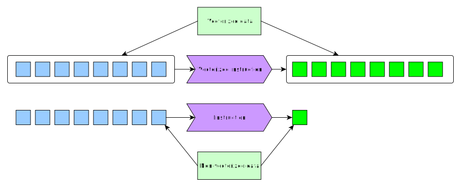

==================
Chapter 4: Scaling
==================

*******************************************************
Different resources involved in data analysis pipelines
*******************************************************

Modern data analysis pipelines can be very expensive computationally. In order
to scale these pipelines up, we'll need to first understand the resources that
these pipelines require. These resources are:

1. Processors (CPUs)
2. Memory (RAM)
3. Storage space
4. Time

Let's look at them one by one. At the end we'll collect the best practices into
a table.

Processors as a resource
========================

Processor is the quintessential resource when it comes to data analysis. It
is used throughout the pipeline from data loading to data analysis and thus
it is important to know some features about them.

Firstly, modern processors are built from multiple cores. Sometimes these
cores can house multiple threads. This is called hyperthreading.

.. image:: images/processor.svg
    :align: center

We'll look at CPU parallelization techniques later on, but for now it's
important to know that the maximum number of threads/processes you should
launch on a given CPU is the number of threads/cores that are available. If you
launch a larger number, you will oversubscribe the CPUs and the code will run
slower as different threads/processes will have to swap in/out of the CPUs.

Secondly, operations on data are done as
`instructions <https://en.wikipedia.org/wiki/Instruction_set_architecture>`_
inside the cores. These instructions handle calculations such as addition,
multiplication etc.. However, in order to get maximum throughput of finished
instructions, all modern CPU architectures have multiple layers of data caching
and prefetching that try to keep the calculating parts of the CPU as busy as
possible.

Data is read to the cache in blocks of data called cache lines. If required data
is not found in the cache, the data needs to be loaded from the system RAM,
which results in a significant performance penalty. This is called a
`cache miss <https://en.wikipedia.org/wiki/CPU_cache#Cache_miss>`_.

.. image:: images/processor-cache.svg
    :align: center

This caching procedure can be helped by keeping the data in memory as a
contiguous array. Both R vectors and numpy ndarrays are contiguous. They have
so-called
`row-major-ordering <https://en.wikipedia.org/wiki/Row-_and_column-major_order>`_.
It is also important to keep this order in mind when doing operations with
multidimensional arrays.

Another important feature of modern processors is that they support vectorized
instructions (AVX, AVX2, AVX512). These dramatically improve the performance
when one does the same operation for multiple pieces of data e.g. elementwise
addition. R, numpy and mathematical libraries that they use such as MKL, BLAS
LAPACK, FFTW etc. use these operations straight out of the box, if the program
is written to use functions from these packages.

We can test the effect of vectorization by looking at the following example
that adds to a zero array.

.. tabs::

  .. tab:: Python

    .. code-block:: python

        n_zeros = 10000
        ntimes = 1000

        z = np.zeros(n_zeros)

        time_for_1 = time.time()
        for t in range(ntimes):
            for i in range(n_zeros):
                z[i] = z[i] + 1
        time_for_2 = time.time()

        time_for = time_for_2-time_for_1

        z = np.zeros(n_zeros)

        time_vec_1 = time.time()
        for t in range(ntimes):
            z = z + 1
        time_vec_2 = time.time()

        time_vec = time_vec_2-time_vec_1

        print("""
        Time taken:

        For loop: %.2g
        Vectorized operation: %.2g

        Speedup: %.0f
        """ % (time_for, time_vec, time_for/time_vec))
        

        Time taken:

        For loop: 4.5
        Vectorized operation: 0.0056

        Speedup: 801

  .. tab:: R

    .. code-block:: R

        n_zeros <- 10000
        ntimes <- 1000

        z <- numeric(n_zeros)

        time_for_1 <- Sys.time()
        for (t in seq(ntimes)) {
            for (i in seq(1,n_zeros)) {
                z[i] <- z[i] + 1
            }
        }
        time_for_2 <- Sys.time()

        time_for <- time_for_2 - time_for_1

        z <- numeric(n_zeros)

        time_vec_1 <- Sys.time()
        for (t in seq(ntimes)) {
            z <- z + 1
        }
        time_vec_2 <- Sys.time()

        time_vec <- time_vec_2 - time_vec_1

        cat(sprintf("Time taken:\n\nFor loop: %.2g\nVectorized operation: %.2g\n\nSpeedup: %.2f", time_for, time_vec, time_for/as.double(time_vec, unit='secs')))

        
        Time taken:

        For loop: 0.61
        Vectorized operation: 0.018

        Speedup: 33.61

RAM as a resource
=================

RAM stores the data and variables that you operate on during your data
analysis workflow. From RAM the data is transferred to processor caches for
operations. In data science pipelines the biggest problem is usually that
one runs out of memory when dealing with big datasets. When thinking about
memory one should always think about the ceiling of memory usage:

- Let's say we read dataset ``d_raw`` e.g. from a csv.
- We convert columns/modify with the input reading part of our pipeline
  ``I(x)`` and obtain a dataset ``d``.

Now the size of the memory we need is
``size(I(d_raw)) = size(d) + size(d_raw)`` and we know that that is our
memory ceiling for the data loading. Now if we keep the original dataset in
memory the ceiling becomes a floor for the next part of our pipeline and we
start to accumulate memory even though we no longer need some of our previous
objects. This is visualized in the image below:

.. image:: images/ram-pipeline.svg
    :align: center

Let's consider
:ref:`boostrapping model <chapter-3-bootstrap>`
that the we had in chapter 3. We read our data into dataset
``filesizes`` and then used aggregation functions to create another dataset
``yearly_bytes_sum`` that we used for our bootstrapping procedure.

.. tabs::

  .. tab:: Python

    .. code-block:: python

        def chapter3_pipeline(n_means=10000):

            filesizes = load_filesizes('../data/filesizes_timestamps.txt')

            yearly_bytes_sum = aggregate_filesize_data(filesizes, ['Year','BytesLog2'], ['Files', 'SpaceUsage'], 'sum')

            bootstrapped_yearly_means = bootstrap_byteslog2_mean(yearly_bytes_sum, 'Year', 'Files', n_means=n_means)

            bootstrapped_yearly_means = bootstrapped_yearly_means.reset_index()[['Year','Mean']]

            return bootstrapped_yearly_means

        chapter3_pipeline(n_means=100).head()
        
        Year 	Mean
        0 	2010.0 	12.9242
        1 	2011.0 	14.0712
        2 	2012.0 	10.6465
        3 	2013.0 	13.3474
        4 	2014.0 	14.0410

  .. tab:: R

    .. code-block:: R

        chapter3_pipeline <- function(n_means=10000) {

            filesizes <- load_filesizes('../data/filesizes_timestamps.txt')

            yearly_bytes_sum <- aggregate_filesize_data(filesizes, c('Year','BytesLog2'), c('Files', 'SpaceUsage'), sum)

            bootstrapped_yearly_means <- yearly_bytes_sum %>%
                bootstrap_byteslog2_mean('Year', 'Files', n_means=n_means) %>%
                select(Year, Mean)

            return(bootstrapped_yearly_means)
        }

        head(chapter3_pipeline(n_means=100))

        Year	Mean
        2010 	12.9871
        2011 	14.1068
        2012 	10.7926
        2013 	13.3482
        2014 	13.9873
        2015 	11.7709

One can calculate the size of a dataset in the following fashion:

.. tabs::

  .. tab:: Python
  
    `pandas.DataFrame.memory_usage <https://pandas.pydata.org/pandas-docs/stable/reference/api/pandas.DataFrame.memory_usage.html>`_

    .. code-block:: python

        filesizes = load_filesizes('../data/filesizes_timestamps.txt')
        yearly_bytes_sum = aggregate_filesize_data(filesizes, ['Year','BytesLog2'], ['Files', 'SpaceUsage'], 'sum')
        print(filesizes.memory_usage(deep=True))
        print(yearly_bytes_sum.memory_usage(deep=True))
        filesizes_size = filesizes.memory_usage(deep=True).sum()
        summarized_size = yearly_bytes_sum.memory_usage(deep=True).sum()
        print("""
        Original data: %d bytes
        Summarized data: %d bytes

        Reduction ratio: %.2f
        """ % (filesizes_size, summarized_size, filesizes_size/summarized_size))
        
        Index         69520
        Bytes         69520
        Files         69520
        BytesLog2     69520
        SpaceUsage    69520
        Year          69520
        Month          9768
        Date          69520
        dtype: int64
        Index          128
        Year           881
        BytesLog2     2097
        Files         3784
        SpaceUsage    3784
        dtype: int64

        Original data: 496408 bytes
        Summarized data: 10674 bytes

        Reduction ratio: 46.51

  .. tab:: R
  
    `object.size <https://www.rdocumentation.org/packages/utils/versions/3.6.2/topics/object.size>`_

    .. code-block:: R

        filesizes <- load_filesizes('../data/filesizes_timestamps.txt')
        yearly_bytes_sum <- aggregate_filesize_data(filesizes, c('Year','BytesLog2'), c('Files', 'SpaceUsage'), sum)

        print_column_sizes <- function(dataset) {
            map(colnames(dataset), function(x) print(sprintf('column: %12s size: %d', x, object.size(dataset[x]))))
            invisible(NULL)
        }

        print('filesizes:')
        print_column_sizes(filesizes)

        print('yearly_bytes_sum:')
        print_column_sizes(yearly_bytes_sum)

        filesizes_size <- object.size(filesizes)
        summarized_size <- object.size(yearly_bytes_sum)

        cat(sprintf("
        Original data: %d bytes
        Summarized data: %d bytes

        Reduction ratio: %.2f
        ", filesizes_size, summarized_size, filesizes_size/summarized_size))
        
        [1] "filesizes:"
        [1] "column:        Bytes size: 70384"
        [1] "column:        Files size: 70384"
        [1] "column:    BytesLog2 size: 70392"
        [1] "column:   SpaceUsage size: 70392"
        [1] "column:         Year size: 70384"
        [1] "column:        Month size: 36872"
        [1] "column:         Date size: 70896"
        [1] "yearly_bytes_sum:"
        [1] "column:         Year size: 3728"
        [1] "column:    BytesLog2 size: 5744"
        [1] "column:        Files size: 4336"
        [1] "column:   SpaceUsage size: 4344"

        Original data: 455320 bytes
        Summarized data: 15920 bytes

        Reduction ratio: 28.60

From the output we can see the following things:

- We can reduce the memory consumption by taking only those columns we're
  interested in.
- We can reduce the memory consumption by converting data with repeating
  values into categorical type (``Year``).
- Converting numerical data with many categories (``BytesLog2``) into
  categorical type can increase memory consumption.

These past datasets become increasingly important when they are carried
around throughout the pipeline. Both Python and R have a garbage collector
that runs occationally and removes unneeded memory allocations. Each object
has a reference counter that tells the garbage collector how many times
the object is referenced. Each time you e.g. assign the object into a variable
the reference counter is increased and each time you overwrite/delete a
variable the reference counter is decreased. Once it reaches zero the
garbage collector knows that the object can be removed.

To help garbage collector one can create parts of your pipeline as functions.
By writing code as function all temporary variables are created to the
function's scope (aka. environment). After the function finishes they are
no longer defined outside of the function and thus they are good for garbage
collecting.

.. tabs::

  .. tab:: Python

    .. code-block:: python

        def memory_scope_test():

            memory_scope_variable = np.random.random(1000)
            print(memory_scope_variable.nbytes)

        memory_scope_test()
        print(memory_scope_variable.nbytes)

        8000

        ---------------------------------------------------------------------------
        NameError                                 Traceback (most recent call last)
        <ipython-input-41-6d1e9e06eb99> in <module>
              5 
              6 memory_scope_test()
        ----> 7 print(memory_scope_variable.nbytes)

        NameError: name 'memory_scope_variable' is not defined

  .. tab:: R

    .. code-block:: R

        memory_scope_test <- function(){
            memory_scope_variable = runif(1000)
            print(object.size(memory_scope_variable))
        }
        memory_scope_test()
        print(object.size(memory_scope_variable))

        8048 bytes

        Error in structure(.Call(C_objectSize, x), class = "object_size"): object 'memory_scope_variable' not found
        Traceback:

        1. print(object.size(memory_scope_variable))
        2. object.size(memory_scope_variable)
        3. structure(.Call(C_objectSize, x), class = "object_size")

One can also call the garbage collector explicitly after removing a variable.
However, this should be thought as a band-aid to memory problems and should
only be used when there's an obvious target for garbage collection (e.g. some
subroutine was called and the memory used by it could be freed, a variable was
explicitly removed, etc.)

.. tabs::

  .. tab:: Python
  
    This example requires the
    `memory_profiler <https://github.com/pythonprofilers/memory_profiler>`_-package.
    It is included in the updated ``environment.yml``, but can also be installed
    with ``pip install memory_profiler`` while the environment is activated.

    .. code-block:: python

        import gc

        def memtest_nocollect(n=1000):

            A = np.random.random(n**2)

            A_mean = np.mean(A)

            time.sleep(5)

            B = np.matrix(np.random.random((n, n)) + A_mean)
            B = B + B.T
            B_inv = np.linalg.inv(B)

            return np.max(B*B_inv)

        def memtest_collect(n=1000):

            A = np.random.random(n**2)

            A_mean = np.mean(A)

            del A
            gc.collect()

            time.sleep(5)

            B = np.matrix(np.random.random((n, n)) + A_mean)
            B = B + B.T
            B_inv = np.linalg.inv(B)

            return np.max(B*B_inv)

        print(memtest_nocollect(100), memtest_collect(100))
        
        1.0000000000000036 1.0000000000000249

    .. code-block:: python
    
        %load_ext memory_profiler

    .. code-block:: python
    
        %memit memtest_nocollect(3000)

        peak memory: 572.32 MiB, increment: 343.27 MiB

    .. code-block:: python
    
        %memit memtest_collect(3000)
        peak memory: 435.05 MiB, increment: 206.00 MiB

  .. tab:: R

    .. code-block:: R

        library(pryr)

        memtest_nocollect <- function(n=1000) {

            print(mem_used())

            A <- runif(n*n)
            A_mean <- mean(A)

            print('No garbage collection done.')
            Sys.sleep(5)

            B <- matrix(runif(n*n), ncol=n)
            B <- B %*% t(B)
            B_inv <- solve(B)

            print(mem_used())

            return(max(B %*% B_inv))
        }

        memtest_collect <- function(n=1000){

            print(mem_used())

            A <- runif(n*n)
            A_mean <- mean(A)

            rm(A)
            print(gc())
            Sys.sleep(5)

            B <- matrix(runif(n*n), ncol=n)
            B <- B %*% t(B)
            B_inv <- solve(B)

            print(mem_used())

            return(max(B %*% B_inv))
        }

        memtest_nocollect(3000)
        memtest_collect(3000)
        
        62.4 MB
        [1] "No garbage collection done."
        278 MB

        1.00000010849908

        62.4 MB
                  used (Mb) gc trigger  (Mb) max used  (Mb)
        Ncells  881669 47.1    1773930  94.8  1214762  64.9
        Vcells 1626091 12.5   37149668 283.5 46639578 355.9
        206 MB

        1.00000000977889

Time as a resource
==================

Time is naturally one of the resources 

.. tabs::

  .. tab:: Python

    .. code-block:: python

        pass

  .. tab:: R

    .. code-block:: R

        NULL

Best practices
==============

+------------+-----------------------+-----------------------------------+
| Resource   | Best practice         | Simplest implementation           |
+============+=======================+===================================+
| CPU        || Do not oversubscribe || Limit the number of processes to |
|            || the CPU              || the amount that CPU can support. |
+------------+-----------------------+-----------------------------------+
| CPU        || Try to avoid cache   || Keep important data in           |
|            || misses               || columns or numeric vectors       |
|            ||                      || (vector/array, ndarray).         |
+------------+-----------------------+-----------------------------------+
| CPU        || Use vectorization    || Operate on vectors using basic   |
|            ||                      || operators when possible. Use     |
|            ||                      || existing functions from          |
|            ||                      || libraries if possible.           |
+------------+-----------------------+-----------------------------------+
| RAM        || Use vectorization    || Operate on vectors using basic   |
|            ||                      || operators when possible. Use     |
|            ||                      || existing functions from          |
|            ||                      || libraries if possible.           |
+------------+-----------------------+-----------------------------------+
| Storage    |                       |                                   |
+------------+-----------------------+-----------------------------------+
| Time       |                       |                                   |
+------------+-----------------------+-----------------------------------+

**************************
Parallelization strategies
**************************

Is multiprocessing worth it?
================================

Normal serial code can't just be run in parallel without modifications. In
order to get the code to run in parallel, one needs to understand what
parallalization implementation your code has, if any. A program doesn't
magically get faster when you have access to more processors if it's not
designed to use them.

When deciding whether using parallel programming is worth the effort, one
should be mindful of
`Amdahl's law <https://en.wikipedia.org/wiki/Amdahl%27s_law>`_ and
`Gustafson's law <https://en.wikipedia.org/wiki/Gustafson%27s_law>`_.
All programs have some parts that can only be executed in serial and
thus the theoretical speedup that one can get from using parallel
programming depends on two factors:

1. How much of programs' execution could be done in parallel?
2. What would be the speedup for that parallel part?

Thus if your program runs mainly in serial but has a small parallel
part, running it in parallel might not be worth it. Sometimes, doing
data parallelism is much more fruitful approach.

Another important note regarding parallelism is that all the applications
scale good up to some upper limit which depends on application implementation,
size and type of problem you solve and some other factors. The best practice
is to benchmark your code on different number of CPU cores before
you start actual production runs.

.. important::

   Python has a global interpreter lock (GIL), which forces some operations to
   be executed on only one thread and when these operations are occuring, other
   threads will be idle. These kinds of operations include reading files and
   doing print statements. Thus one should be extra careful with multithreaded
   code as it is easy to create seemingly parallel code that does not actually
   utilize multiple CPUs. Most Python parallelization implementations use
   multiprocessing instead of multithreading to bypass the GIL.